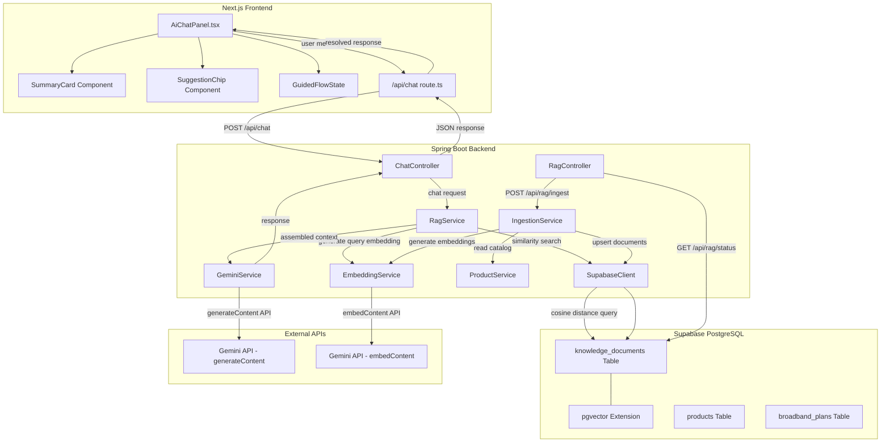
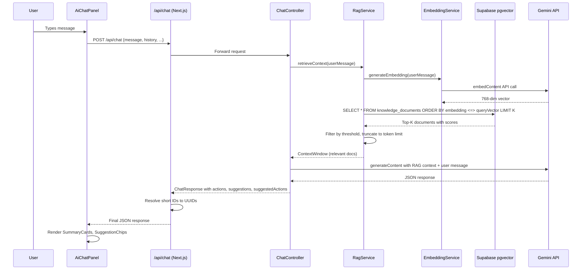
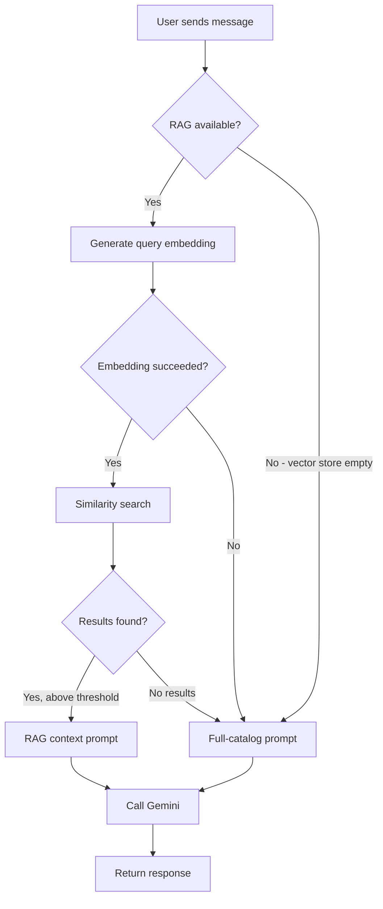

# Design Document: AI RAG-Enhanced Chat

## Overview

This design enhances the existing AI shopping assistant chat with Retrieval Augmented Generation (RAG) to deliver precise, context-aware responses. Currently, the system injects the entire product catalog and broadband plan list into every LLM prompt via `createShoppingAssistantPrompt()` in `src/lib/prompts.ts` and `buildSystemPrompt()` in `GeminiService.java`. This approach scales poorly as the catalog grows and wastes tokens on irrelevant context.

The RAG enhancement introduces:
1. A **pgvector-backed vector store** in Supabase to store embeddings for products, broadband plans, and future knowledge documents.
2. An **embedding and ingestion pipeline** on the Spring Boot backend that converts catalog data into 768-dimensional vectors using the Gemini embedding model.
3. A **RAG retrieval pipeline** that generates a query embedding, performs cosine similarity search, filters by relevance threshold, and assembles a focused context window for the LLM prompt.
4. **Structured Summary Cards** and **Suggestion Chips** in the `AiChatPanel` React component for actionable, visually rich AI responses.
5. A **Guided Broadband Flow** within the chat that mirrors the broadband purchase journey steps (postcode → address → plan → add-ons → summary).

The existing `POST /api/chat` endpoint and request/response format remain backward-compatible. RAG retrieval is transparent to the frontend — when relevant documents are found, they replace the full catalog in the prompt; when RAG fails, the system falls back to the existing full-catalog approach.

## Architecture



### Data Flow for a Chat Request



### Key Design Decisions

1. **RAG on the backend (Spring Boot), not the Next.js route**: The backend already owns the Supabase connection via `SupabaseClient` and the Gemini API key. Keeping RAG server-side avoids duplicating credentials and database access in the Next.js layer. The Next.js `/api/chat` route continues to proxy to the backend `ChatController`.

2. **Gemini embedding model (text-embedding-004)**: Produces 768-dimensional vectors, matching the `VECTOR(768)` column. Using the same provider for embeddings and generation simplifies API key management.

3. **IVFFlat index over HNSW**: IVFFlat is simpler to configure and sufficient for the expected catalog size (hundreds to low thousands of documents). HNSW can be swapped in later if needed.

4. **Fallback to full-catalog prompt**: Any RAG failure (embedding generation, similarity search timeout, empty vector store) gracefully degrades to the existing behavior, ensuring zero downtime for users.

5. **Frontend-driven guided flow state**: The broadband guided flow state (current step, selected postcode/address/plan) lives in the `AiChatPanel` React component state, not on the backend. This keeps the backend stateless and avoids session management complexity.

## Components and Interfaces

### Backend Components (Java / Spring Boot)

#### 1. EmbeddingService
Responsible for generating vector embeddings via the Gemini embedding API.

```java
@Service
public class EmbeddingService {
    // Calls Gemini embedContent API (text-embedding-004)
    // Returns a 768-dimensional float array
    public float[] generateEmbedding(String text);
}
```

- Uses `gemini.embedding.model` config property (default: `text-embedding-004`)
- HTTP client with 5-second timeout
- Throws `EmbeddingException` on API failure

#### 2. RagService
Orchestrates the RAG pipeline: query embedding → similarity search → context assembly.

```java
@Service
public class RagService {
    // Main entry point: returns assembled context for a user query
    public RagContext retrieveContext(String userQuery);

    // Similarity search against knowledge_documents
    List<KnowledgeDocument> similaritySearch(float[] queryEmbedding, int topK);

    // Filter and assemble context window
    RagContext assembleContext(List<KnowledgeDocument> documents, double threshold, int maxTokens);
}
```

- Configurable via `rag.top-k` (default 5), `rag.relevance-threshold` (default 0.3), `rag.max-context-tokens` (default 2000)
- Returns `RagContext` containing the formatted context string and list of source IDs
- Falls back to `null` context on any failure (caller uses full-catalog prompt)

#### 3. IngestionService
Handles reading catalog data, generating embeddings, and upserting into the vector store.

```java
@Service
public class IngestionService {
    // Full re-ingestion of all products and broadband plans
    public IngestionResult ingestAll();

    // Single document upsert (for incremental updates)
    public void upsertDocument(String sourceType, String sourceId, String content, Map<String, Object> metadata);

    // Delete a document by source
    public void deleteDocument(String sourceType, String sourceId);
}
```

- `IngestionResult` contains `totalIngested`, `failures`, and `timestamp`
- Builds content strings from Product and BroadbandPlan fields
- Upserts by matching on `metadata->>'source_type'` and `metadata->>'source_id'`

#### 4. RagController
REST endpoints for RAG administration.

```java
@RestController
@RequestMapping("/api/rag")
public class RagController {
    @PostMapping("/ingest")
    public IngestionResult ingest();

    @GetMapping("/status")
    public RagStatus getStatus();
}
```

#### 5. ChatController (Modified)
The existing `ChatController` is updated to inject `RagService`. When RAG context is available, it passes it to `GeminiService` instead of the full catalog.

#### 6. GeminiService (Modified)
Extended with a new method that accepts a RAG context window:

```java
public ChatResponse chatWithContext(ChatRequest request, RagContext ragContext);
```

When `ragContext` is non-null, the system prompt includes a `RELEVANT CONTEXT` section with the retrieved documents instead of the full product list.

### Backend Models

#### KnowledgeDocument
```java
@Data
public class KnowledgeDocument {
    private String id;           // UUID
    private String content;      // Human-readable chunk text
    private Map<String, Object> metadata;  // {source_type, source_id, ...}
    private float[] embedding;   // 768-dim vector
    private double relevanceScore; // Set after similarity search
    private Instant createdAt;
}
```

#### RagContext
```java
@Data
public class RagContext {
    private String contextWindow;       // Formatted text for LLM prompt
    private List<String> sourceIds;     // Product/plan UUIDs referenced
    private int documentCount;          // Number of docs in context
}
```

#### IngestionResult
```java
@Data
public class IngestionResult {
    private int totalIngested;
    private int failures;
    private Instant timestamp;
    private List<String> failedSourceIds;
}
```

#### RagStatus
```java
@Data
public class RagStatus {
    private long totalDocuments;
    private Instant lastIngestionTimestamp;
    private int pendingQueueItems;
}
```

### Frontend Components (React / TypeScript)

#### 1. SummaryCard Component
Renders a structured card for a product or broadband plan recommendation.

```typescript
interface SummaryCardProps {
    type: 'product' | 'broadband';
    data: ProductSummary | BroadbandSummary;
    onAction: (actionType: string, id: string) => void;
}
```

- Product cards show: name, price, brand, rating, "Add to Cart" button
- Broadband cards show: plan name, download/upload speed, monthly price, contract length, "Select Plan" button
- Promotional label badge when applicable
- Max 3 cards per response (enforced by the parent component)

#### 2. SuggestionChip Component
Renders a clickable chip for contextual next-step suggestions.

```typescript
interface SuggestionChipProps {
    label: string;
    onClick: (label: string) => void;
}
```

- Clicking sends the chip label as a new user message
- 2-4 chips per response
- Default chips generated based on query category when LLM doesn't provide `suggestedActions`

#### 3. GuidedFlowState (in AiChatPanel)
State management for the broadband purchase guided flow within the chat.

```typescript
interface GuidedFlowState {
    active: boolean;
    currentStep: 'postcode' | 'address' | 'plan' | 'addons' | 'summary';
    postcode?: string;
    selectedAddress?: BroadbandAddress;
    selectedPlan?: BroadbandPlan;
    selectedAddons?: string[];
}
```

- Tracked in `AiChatPanel` component state via `useState`
- Step transitions triggered by user actions (chip clicks, card button clicks)
- "Go back" resets to the specified step

### Modified Response Format

The existing `ChatResponse` JSON format is extended (backward-compatible):

```json
{
    "actions": [{"action": "...", "payload": "..."}],
    "suggestions": ["p0", "p1"],
    "message": "string",
    "comparison": {},
    "summaryCards": [
        {
            "type": "product",
            "id": "uuid",
            "name": "iPhone 15",
            "price": 999,
            "brand": "Apple",
            "rating": 4.5,
            "promotionalLabel": "20% off"
        }
    ],
    "suggestedActions": ["Compare plans", "Check availability", "View add-ons"]
}
```

New fields (`summaryCards`, `suggestedActions`) are optional and additive — existing clients that don't read them continue to work.

## Data Models

### Database Schema

#### knowledge_documents Table

```sql
-- Enable pgvector extension
CREATE EXTENSION IF NOT EXISTS vector;

-- Knowledge documents table for RAG
CREATE TABLE knowledge_documents (
    id UUID PRIMARY KEY DEFAULT gen_random_uuid(),
    content TEXT NOT NULL,
    metadata JSONB NOT NULL DEFAULT '{}',
    embedding VECTOR(768) NOT NULL,
    created_at TIMESTAMPTZ NOT NULL DEFAULT now()
);

-- IVFFlat index for fast cosine similarity search
CREATE INDEX idx_knowledge_documents_embedding
    ON knowledge_documents
    USING ivfflat (embedding vector_cosine_ops)
    WITH (lists = 100);

-- Index on metadata for filtering by source_type
CREATE INDEX idx_knowledge_documents_source_type
    ON knowledge_documents ((metadata->>'source_type'));

-- Unique constraint to prevent duplicate documents per source
CREATE UNIQUE INDEX idx_knowledge_documents_source_unique
    ON knowledge_documents ((metadata->>'source_type'), (metadata->>'source_id'));
```

#### Similarity Search Query

```sql
SELECT id, content, metadata, 
       1 - (embedding <=> $1::vector) AS relevance_score
FROM knowledge_documents
WHERE 1 - (embedding <=> $1::vector) >= $2
ORDER BY embedding <=> $1::vector
LIMIT $3;
```

Parameters:
- `$1`: Query embedding vector (768 dimensions)
- `$2`: Relevance threshold (default 0.3)
- `$3`: Top-K limit (default 5)

### Content Format for Knowledge Documents

#### Product Document Content
```
Product: iPhone 15 Pro
Brand: Apple
Category: Mobile
Price: £999.00
Description: The latest iPhone with A17 Pro chip...
Specs: Storage:256GB; RAM:8GB; Display:6.1" OLED; Camera:48MP
Rating: 4.7/5
```

#### Broadband Plan Document Content
```
Broadband Plan: Superfast Fibre
Download Speed: 67 Mbps
Upload Speed: 18 Mbps
Technology: FTTC
Contract Length: 18 months
Monthly Price: £28.99/mo
Promotional Label: Best Value
```

### Configuration Properties

Added to `application.properties`:

```properties
# RAG Configuration
rag.top-k=5
rag.relevance-threshold=0.3
rag.max-context-tokens=2000

# Embedding Model
gemini.embedding.model=text-embedding-004
```

## Correctness Properties

*A property is a characteristic or behavior that should hold true across all valid executions of a system — essentially, a formal statement about what the system should do. Properties serve as the bridge between human-readable specifications and machine-verifiable correctness guarantees.*

### Property 1: Ingested document content completeness

*For any* product or broadband plan in the source catalog, when ingested into the vector store, the resulting knowledge document's content field shall contain all required fields for that source type (product: name, description, brand, category, price, specs, rating; broadband: plan name, download speed, upload speed, technology type, contract length, monthly price), and the metadata shall contain the correct source_type and source_id.

**Validates: Requirements 1.4, 1.5**

### Property 2: Embedding dimensionality

*For any* non-empty content string passed to the EmbeddingService, the returned embedding vector shall have exactly 768 dimensions.

**Validates: Requirements 2.2**

### Property 3: Ingestion idempotence

*For any* set of products and broadband plans, running the ingestion pipeline twice shall produce the same number of knowledge documents as running it once (no duplicates created).

**Validates: Requirements 2.3**

### Property 4: Ingestion resilience and reporting

*For any* ingestion run over N source entities where some embedding calls fail, the totalIngested count plus the failures count shall equal N, and all non-failed entities shall have their knowledge documents in the vector store.

**Validates: Requirements 2.6, 2.7**

### Property 5: Similarity search respects top-K limit

*For any* query embedding and vector store state, the similarity search shall return at most K documents (where K is the configured top-k value).

**Validates: Requirements 3.2, 8.1**

### Property 6: Relevance threshold filtering

*For any* set of documents returned by the RAG pipeline's context assembly, every document shall have a relevance score greater than or equal to the configured threshold.

**Validates: Requirements 3.3, 8.2**

### Property 7: Context assembly includes source metadata

*For any* assembled context window, each document entry shall be prefixed with its source_type label, shall include the source_id, and the context shall appear as a "RELEVANT CONTEXT" section in the final LLM prompt before the user message.

**Validates: Requirements 3.4, 3.5, 3.6, 8.5**

### Property 8: Context window token limit

*For any* assembled context window, the total token count shall not exceed the configured maximum token count.

**Validates: Requirements 3.8**

### Property 9: Context ordering by relevance

*For any* assembled context window containing multiple documents, the documents shall be ordered by relevance score in descending order.

**Validates: Requirements 8.3**

### Property 10: Truncation removes lowest-scoring first

*For any* set of retrieved documents whose total content exceeds the configured maximum token count, the documents removed during truncation shall be those with the lowest relevance scores, and the remaining documents shall still be ordered by descending relevance score.

**Validates: Requirements 8.4**

### Property 11: Short ID resolution

*For any* chat response containing short IDs (p0, p1, ...) in actions, suggestions, or summary cards, all short IDs shall be resolved to valid UUIDs that correspond to real products or broadband plans.

**Validates: Requirements 4.4**

### Property 12: Response format backward compatibility

*For any* chat response, the JSON shall contain the fields: actions (array), suggestions (array), and message (string). New fields (summaryCards, suggestedActions) shall be optional and their absence shall not break existing consumers.

**Validates: Requirements 4.5**

### Property 13: Summary card field completeness

*For any* summary card in a chat response, if the type is "product" then the card shall contain name, price, brand, and rating fields; if the type is "broadband" then the card shall contain plan name, download speed, upload speed, monthly price, and contract length fields.

**Validates: Requirements 5.1, 5.2**

### Property 14: Summary card action dispatch

*For any* summary card, clicking the action button shall dispatch the correct action type ("add_to_cart" for products, "add_broadband_to_cart" for broadband) with the correct entity ID as payload.

**Validates: Requirements 5.3, 5.4**

### Property 15: Promotional label display

*For any* summary card whose underlying product or plan has a non-null promotional label, the card shall display the promotional label badge. For those without a promotional label, no badge shall be displayed.

**Validates: Requirements 5.5**

### Property 16: Max 3 summary cards per response

*For any* AI response containing summary cards, the Chat_Panel shall render at most 3 summary cards.

**Validates: Requirements 5.6**

### Property 17: Suggestion chip click sends message

*For any* suggestion chip rendered in the chat, clicking it shall send the chip's label text as a new user message to the chat.

**Validates: Requirements 6.3**

### Property 18: Suggestion chip count bounds

*For any* AI response that includes suggestion chips, the number of rendered chips shall be between 2 and 4 inclusive.

**Validates: Requirements 6.4**

### Property 19: Default suggestion chips fallback

*For any* AI response that does not include a `suggestedActions` array, the Chat_Panel shall generate default suggestion chips based on the detected query category (product or broadband).

**Validates: Requirements 6.6**

### Property 20: Guided flow state machine validity

*For any* guided flow state, the current step shall be one of {postcode, address, plan, addons, summary}. Transitioning forward shall advance to the next step. Requesting to go back to step M from step N (where M < N) shall reset the state to step M and clear selections made after step M.

**Validates: Requirements 7.6, 7.7**

### Property 21: Catalog change triggers re-embedding

*For any* product or broadband plan that is created or updated, the corresponding knowledge document in the vector store shall be updated with a new embedding reflecting the current data.

**Validates: Requirements 2.5, 9.1, 9.2**

### Property 22: Deletion removes knowledge document

*For any* product or broadband plan that is deleted or deactivated, the corresponding knowledge document shall be removed from the vector store.

**Validates: Requirements 9.4**

### Property 23: Chat panel renders regardless of source

*For any* valid chat response JSON (whether generated via RAG context or full-catalog fallback), the Chat_Panel shall render the message, actions, and any summary cards or suggestion chips without error.

**Validates: Requirements 10.4**

## Error Handling

### Backend Error Handling

| Error Scenario | Handling Strategy | Fallback |
|---|---|---|
| Embedding API failure (query) | Log error, return null RagContext | ChatController uses full-catalog prompt |
| Embedding API failure (ingestion) | Log failure with source_id, skip document | Continue processing remaining documents |
| Similarity search timeout (>3s) | Log timeout, return null RagContext | ChatController uses full-catalog prompt |
| Similarity search DB error | Log error, return null RagContext | ChatController uses full-catalog prompt |
| Empty vector store (0 documents) | Log warning, return null RagContext | ChatController uses full-catalog prompt |
| Gemini generateContent failure | Return error ChatResponse | Existing error handling in GeminiService |
| Ingestion endpoint failure | Return IngestionResult with failure count | Partial ingestion succeeds for non-failed docs |

### Frontend Error Handling

| Error Scenario | Handling Strategy | User Experience |
|---|---|---|
| Chat API returns error | Display "Sorry, something went wrong." | Existing behavior preserved |
| Summary card data missing fields | Render card with available fields, hide missing | Graceful degradation |
| Guided flow API error (address lookup, eligibility) | Display error message in chat | Offer "Try again" suggestion chip |
| Invalid summary card action | Log warning, no-op | No visible error to user |

### Fallback Chain



## Testing Strategy

### Property-Based Testing

Property-based tests use randomized inputs to verify that correctness properties hold across all valid inputs. Each property from the Correctness Properties section maps to a single property-based test.

**Backend (Java)**: Use **jqwik** as the property-based testing library.
- Each test runs a minimum of 100 iterations
- Each test is tagged with a comment referencing the design property

**Frontend (TypeScript)**: Use **fast-check** as the property-based testing library.
- Each test runs a minimum of 100 iterations
- Each test is tagged with a comment referencing the design property

### Backend Property Tests (jqwik)

| Property | Test Description | Tag |
|---|---|---|
| P1 | Generate random products/plans, ingest, verify content fields | Feature: ai-rag-enhanced-chat, Property 1: Ingested document content completeness |
| P2 | Generate random strings, call EmbeddingService, verify 768 dimensions | Feature: ai-rag-enhanced-chat, Property 2: Embedding dimensionality |
| P3 | Generate random catalog, run ingestion twice, verify same doc count | Feature: ai-rag-enhanced-chat, Property 3: Ingestion idempotence |
| P4 | Generate N entities with some failing embeddings, verify counts | Feature: ai-rag-enhanced-chat, Property 4: Ingestion resilience and reporting |
| P5 | Generate random embeddings, run similarity search, verify <= K results | Feature: ai-rag-enhanced-chat, Property 5: Similarity search respects top-K limit |
| P6 | Generate random documents with varying scores, verify all >= threshold | Feature: ai-rag-enhanced-chat, Property 6: Relevance threshold filtering |
| P7 | Generate random documents, assemble context, verify metadata present | Feature: ai-rag-enhanced-chat, Property 7: Context assembly includes source metadata |
| P8 | Generate random documents, assemble context, verify token count <= max | Feature: ai-rag-enhanced-chat, Property 8: Context window token limit |
| P9 | Generate random documents with scores, verify descending order | Feature: ai-rag-enhanced-chat, Property 9: Context ordering by relevance |
| P10 | Generate documents exceeding token limit, verify lowest-scored removed | Feature: ai-rag-enhanced-chat, Property 10: Truncation removes lowest-scoring first |
| P11 | Generate responses with short IDs, verify UUID resolution | Feature: ai-rag-enhanced-chat, Property 11: Short ID resolution |
| P12 | Generate random chat responses, verify required fields present | Feature: ai-rag-enhanced-chat, Property 12: Response format backward compatibility |
| P21 | Generate random product updates, verify knowledge doc updated | Feature: ai-rag-enhanced-chat, Property 21: Catalog change triggers re-embedding |
| P22 | Generate random deletions, verify knowledge doc removed | Feature: ai-rag-enhanced-chat, Property 22: Deletion removes knowledge document |

### Frontend Property Tests (fast-check)

| Property | Test Description | Tag |
|---|---|---|
| P13 | Generate random summary card data, verify required fields rendered | Feature: ai-rag-enhanced-chat, Property 13: Summary card field completeness |
| P14 | Generate random cards, simulate click, verify correct action dispatched | Feature: ai-rag-enhanced-chat, Property 14: Summary card action dispatch |
| P15 | Generate cards with/without promo labels, verify badge presence | Feature: ai-rag-enhanced-chat, Property 15: Promotional label display |
| P16 | Generate responses with 0-10 cards, verify max 3 rendered | Feature: ai-rag-enhanced-chat, Property 16: Max 3 summary cards per response |
| P17 | Generate random chip labels, simulate click, verify message sent | Feature: ai-rag-enhanced-chat, Property 17: Suggestion chip click sends message |
| P18 | Generate responses with varying chip counts, verify 2-4 rendered | Feature: ai-rag-enhanced-chat, Property 18: Suggestion chip count bounds |
| P19 | Generate responses without suggestedActions, verify defaults generated | Feature: ai-rag-enhanced-chat, Property 19: Default suggestion chips fallback |
| P20 | Generate random step sequences, verify valid transitions and back navigation | Feature: ai-rag-enhanced-chat, Property 20: Guided flow state machine validity |
| P23 | Generate valid responses (RAG and fallback), verify rendering | Feature: ai-rag-enhanced-chat, Property 23: Chat panel renders regardless of source |

### Unit Tests

Unit tests complement property tests by covering specific examples, edge cases, and integration points:

**Backend unit tests:**
- Ingestion endpoint returns 200 and valid IngestionResult
- Status endpoint returns document count and timestamp
- Similarity search with empty vector store returns empty list
- RAG fallback when embedding service throws exception
- RAG fallback when similarity search times out (>3s)
- Context assembly with zero results above threshold falls back
- Backward-compatible request format accepted by /api/chat

**Frontend unit tests:**
- SummaryCard renders product card with all fields
- SummaryCard renders broadband card with all fields
- SuggestionChip renders and handles click
- Guided flow initiates on broadband availability query
- Guided flow step transitions (postcode → address → plan → addons → summary)
- Guided flow "go back" resets to correct step
- Guided flow API error shows error message and "Try again" chip
- Chat panel renders response without summaryCards/suggestedActions (backward compat)
