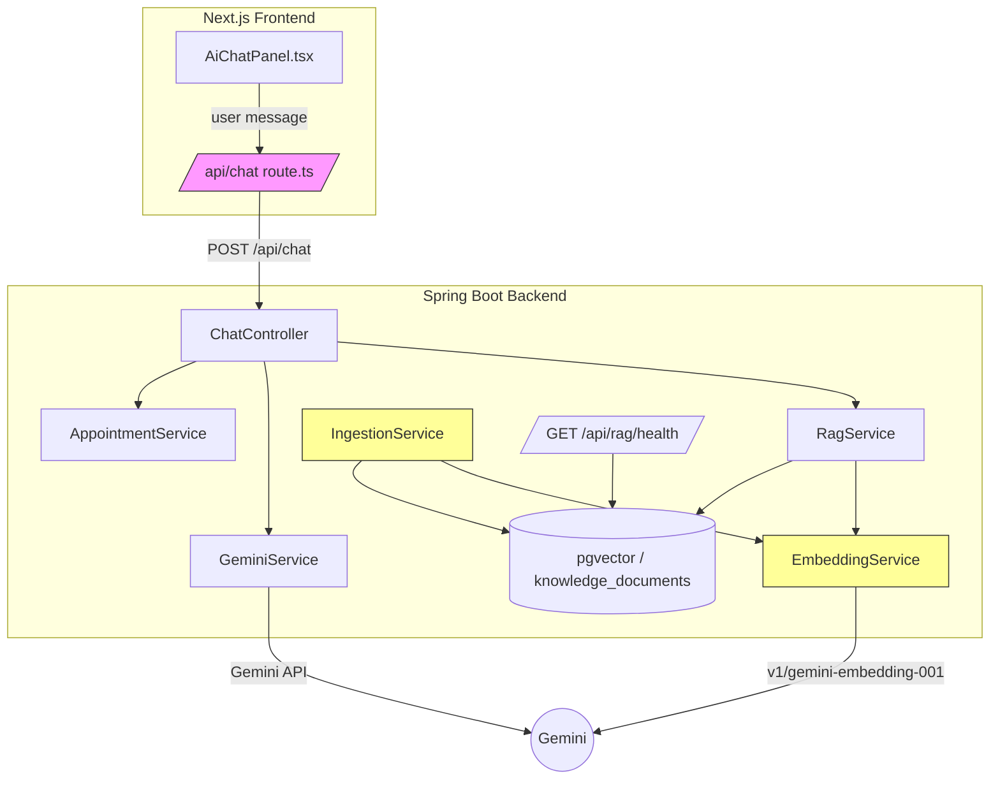

# Design Document: Broadband Chat UX Improvements

## Overview

This design addresses seven interconnected issues in the broadband chat experience: poor list formatting, truncated address display, lack of preference-based filtering, missing plan feature inquiry support, inability to handle installation date queries, the frontend bypassing the backend RAG pipeline, and a broken embedding/ingestion pipeline.

The changes span both the Next.js frontend (`AiChatPanel.tsx`, `src/app/api/chat/route.ts`, `src/lib/prompts.ts`) and the Spring Boot backend (`EmbeddingService.java`, `IngestionService.java`, `ChatController.java`, `GeminiService.java`). The core architectural shift is routing all chat traffic through the backend RAG endpoint instead of calling Gemini directly from the frontend, and fixing the embedding model so the RAG vector store actually contains data.

## Architecture



### Current State (Problems)

1. `route.ts` fetches full product catalog from 4 backend REST endpoints, builds a massive system prompt via `createShoppingAssistantPrompt`, and calls Gemini SDK directly — the backend RAG pipeline is never used.
2. `EmbeddingService` calls `v1beta/models/text-embedding-004:embedContent` which returns HTTP 404 for every request, so `IngestionService.ingestAll()` fails on every item, leaving `knowledge_documents` empty.
3. `AiChatPanel` renders addresses as numbered text (`1. Address`) and only shows 4 address chips via `addresses.slice(0, 4)`.
4. Plans are shown immediately after address selection with no preference gathering step.
5. Plan feature queries and installation date queries are not recognized by the guided flow.

### Target State

1. `route.ts` becomes a thin proxy: forwards messages + history + cart context to `POST /api/chat` on the backend. No more catalog fetching or prompt construction on the frontend.
2. `EmbeddingService` uses `v1/models/gemini-embedding-001:embedContent`. `IngestionService` adds rate-limit handling (per-item delay, batching, exponential backoff retries). On startup, auto-ingests if vector store is empty.
3. `AiChatPanel` renders all addresses as bulleted lists with chips for every address. The system prompt instructs the AI to use bullet-point formatting for all lists.
4. After address selection, a preference prompt step is inserted before plan display. Users can filter by speed/budget/contract or bypass with "Show all plans".
5. The guided flow recognizes plan feature queries at the summary and plan steps, and installation date queries at any step, routing them to `AppointmentService`.

## Components and Interfaces

### 1. Frontend Chat Route (`src/app/api/chat/route.ts`)

**Change:** Replace direct Gemini SDK calls with a proxy to the backend.

```typescript
// New simplified route
export async function POST(req: Request) {
  const { message, history, cartItems, appliedCouponCode } = await req.json();
  
  const backendRes = await fetch(`${API_URL}/api/chat`, {
    method: 'POST',
    headers: { 'Content-Type': 'application/json' },
    body: JSON.stringify({ message, history, cartItems, appliedCouponCode })
  });
  
  if (!backendRes.ok) {
    return NextResponse.json({ 
      action: 'none', 
      message: 'Chat service is temporarily unavailable. Please try again.' 
    });
  }
  
  return NextResponse.json(await backendRes.json());
}
```

Removals:
- `GoogleGenerativeAI` import and SDK initialization
- `fetchBackendData()` cache and all 4 REST API fetches
- `createShoppingAssistantPrompt` call
- `resolveId` / `resolvePayload` logic (backend handles ID resolution)
- `extractMessage` helper

### 2. Backend ChatRequest Model Enhancement

**Change:** Extend `ChatRequest` to accept cart context and coupon info from the frontend.

```java
@Data
@NoArgsConstructor
@AllArgsConstructor
public class ChatRequest {
    private String message;
    private List<ChatMessage> history;
    private List<CartItem> cartItems;        // NEW
    private String appliedCouponCode;         // NEW
    
    @Data
    public static class CartItem {
        private String productId;
        private String name;
        private double price;
        private int quantity;
    }
}
```

### 3. Backend ChatController Enhancement

**Change:** Pass cart context to `GeminiService`. Add appointment-related action handling.

The controller already retrieves RAG context and calls `geminiService.chatWithContext()`. The enhancement is to forward cart items so the system prompt includes cart state, and to recognize appointment-related actions in the response.

### 4. System Prompt Updates (`src/lib/prompts.ts` and `GeminiService.buildRagSystemPrompt`)

**Change:** Add rules for:
- Bullet-point formatting for all lists of 2+ items
- Recognizing plan feature queries and responding with structured plan data
- Recognizing installation date queries and routing to appointment actions
- Including item count before lists (e.g., "I found 8 addresses")

The backend `buildRagSystemPrompt` method will be updated to include these instructions alongside the RAG context window.

### 5. AiChatPanel Guided Flow Changes

#### 5a. Address Display (Requirement 2)

**Change in `handlePostcodeStep`:**
- Format addresses as bulleted list: `• Address line` instead of `1. Address line`
- Generate chips for ALL addresses, not `addresses.slice(0, 4)`
- Chip container uses `flexWrap: 'wrap'` and `overflow-y: auto` with `max-height` for scrollability

#### 5b. Preference Prompt Step (Requirement 3)

**New guided flow step: `preferences`** inserted between `address` and `plan` in `STEP_ORDER`.

```
STEP_ORDER: ['postcode', 'address', 'preferences', 'plan', 'addons', 'summary']
```

After address selection, instead of immediately fetching plans, the flow prompts:
> "What are you looking for in a broadband plan? You can tell me about your speed needs, budget, contract preference, or usage type — or just show all plans."

Suggested action chips: `['Fast speeds', 'Budget-friendly', 'Short contract', 'Show all plans']`

When the user provides preferences, the flow fetches plans and filters client-side:
- Speed keywords → filter by `downloadSpeedMbps` thresholds
- Budget keywords → sort by `monthlyPrice`, take cheapest N
- Contract keywords → filter by `contractLengthMonths`
- "Show all plans" → no filter

The same pattern applies to add-ons: after plan selection, ask about add-on preferences before displaying all add-ons, with a "Show all add-ons" bypass.

#### 5c. Plan Feature Queries (Requirement 4)

**Change in `processGuidedFlowMessage`:**

At the `summary` and `plan` steps, before the default handler, check if the user message matches plan feature query patterns (e.g., "features", "details", "what does this plan include", "tell me more").

If matched at `summary` step: respond with the selected plan's full attributes (name, speeds, tech, contract, price, promo label, router, activation fee, speed guarantee, out-of-contract price) and re-show the summary action chips.

If matched at `plan` step: respond with details of the plan mentioned or all displayed plans.

If no plan is selected/displayed: inform the user and suggest selecting a plan first.

#### 5d. Installation Date Queries (Requirement 5)

**Change in `processGuidedFlowMessage` and `sendMessage`:**

Add installation date query detection (keywords: "installation", "install date", "book installation", "appointment", "engineer visit"). This detection runs at any guided flow step and also in the non-guided chat path.

When detected:
1. If no active order/session → inform user to complete purchase first
2. If active → call `apiClient.getAvailableSlots()` and display as bulleted list with selectable chips
3. On slot selection → call `apiClient.bookAppointment()` and confirm booking
4. On "check my installation" → call `apiClient.getAppointment()` and display details

### 6. EmbeddingService Fix (Requirement 7)

**Changes:**
- Default model: `text-embedding-004` → `gemini-embedding-001`
- API URL: `v1beta` → `v1`
- `application.properties`: `gemini.embedding.model=gemini-embedding-001`

```java
String url = String.format(
    "https://generativelanguage.googleapis.com/v1/models/%s:embedContent?key=%s",
    embeddingModel, apiKey);
```

### 7. IngestionService Hardening (Requirement 7)

**New configuration properties:**
```properties
ingestion.item-delay-ms=200
ingestion.batch-size=10
ingestion.batch-pause-ms=2000
ingestion.max-retries=3
```

**Changes to `ingestAll()`:**
- Process items in batches of `batch-size`
- Insert `item-delay-ms` between each embedding call
- Pause `batch-pause-ms` between batches
- On 429/5xx errors: retry with exponential backoff (base 1s, max 3 retries)
- Log each retry attempt with retry number, wait duration, and error
- Log full error response body including status code and rate-limit headers
- After exhausting retries: log item ID + error, continue to next item
- At completion: log summary (total attempted, succeeded, failed)

**Startup auto-ingestion:**
- Add `@EventListener(ApplicationReadyEvent.class)` method
- Query `knowledge_documents` count
- If count == 0, trigger `ingestAll()` asynchronously

### 8. RAG Health Check Endpoint (Requirement 7)

**New endpoint:** `GET /api/rag/health`

```java
@GetMapping("/api/rag/health")
public Map<String, Object> health() {
    long count = // query knowledge_documents count
    Map<String, Object> result = new HashMap<>();
    result.put("documentCount", count);
    result.put("status", count > 0 ? "healthy" : "empty");
    if (count == 0) {
        result.put("warning", "RAG pipeline has no data to search against");
    }
    return result;
}
```

## Data Models

### ChatRequest (Enhanced)

| Field | Type | Description |
|-------|------|-------------|
| message | String | User's chat message |
| history | List\<ChatMessage\> | Conversation history |
| cartItems | List\<CartItem\> | Current cart state from frontend |
| appliedCouponCode | String | Currently applied coupon code |

### CartItem (New nested class)

| Field | Type | Description |
|-------|------|-------------|
| productId | String | Product UUID |
| name | String | Product display name |
| price | double | Unit price |
| quantity | int | Quantity in cart |

### GuidedFlowState (Enhanced)

| Field | Type | Description |
|-------|------|-------------|
| active | boolean | Whether guided flow is active |
| currentStep | string | Current step in flow |
| postcode | string? | Entered postcode |
| selectedAddress | BroadbandAddress? | Selected address |
| preferences | PreferenceFilter? | User's stated preferences (NEW) |
| selectedPlan | BroadbandPlan? | Selected plan |
| selectedAddons | string[] | Selected addon IDs |

### PreferenceFilter (New)

| Field | Type | Description |
|-------|------|-------------|
| speedTier | 'fast' \| 'standard' \| null | Speed preference |
| maxBudget | number \| null | Maximum monthly price |
| maxContractMonths | number \| null | Maximum contract length |
| usageType | string \| null | Usage description |
| showAll | boolean | Bypass filtering |

### IngestionConfig (New properties)

| Property | Type | Default | Description |
|----------|------|---------|-------------|
| ingestion.item-delay-ms | int | 200 | Delay between embedding API calls |
| ingestion.batch-size | int | 10 | Items per batch |
| ingestion.batch-pause-ms | int | 2000 | Pause between batches |
| ingestion.max-retries | int | 3 | Max retries per failed embedding call |

### RAG Health Response (New)

| Field | Type | Description |
|-------|------|-------------|
| documentCount | long | Number of documents in vector store |
| status | String | "healthy" or "empty" |
| warning | String? | Warning message when status is "empty" |

## Correctness Properties

*A property is a characteristic or behavior that should hold true across all valid executions of a system — essentially, a formal statement about what the system should do. Properties serve as the bridge between human-readable specifications and machine-verifiable correctness guarantees.*

### Property 1: List formatting produces bulleted output with count

*For any* list of N items (where N ≥ 2) representing addresses, plans, add-ons, or features, the formatted message output should contain exactly N lines each prefixed with a bullet character, and the message preceding the list should contain the number N.

**Validates: Requirements 1.1, 1.3**

### Property 2: All addresses displayed and selectable

*For any* address list of size N returned by the address lookup, the chat panel should render exactly N address chips and the displayed message should contain all N addresses — no truncation regardless of N.

**Validates: Requirements 2.1, 2.2, 2.3**

### Property 3: Numeric address selection resolves correctly

*For any* address list of size N and any integer i where 1 ≤ i ≤ N, selecting index i should resolve to the (i-1)th address in the original list.

**Validates: Requirements 2.4**

### Property 4: Preference filtering returns only matching plans

*For any* set of broadband plans and any PreferenceFilter, every plan in the filtered result should satisfy all non-null filter criteria (speed ≥ threshold, price ≤ maxBudget, contractMonths ≤ maxContractMonths). When `showAll` is true, the filtered result should equal the full plan set.

**Validates: Requirements 3.3, 3.5, 3.6**

### Property 5: Plan feature response contains all key attributes

*For any* BroadbandPlan and any plan feature query message, the response text should contain the plan's name, download speed, upload speed, technology type, contract length, and monthly price.

**Validates: Requirements 4.1, 4.2, 4.3**

### Property 6: Appointment booking round trip

*For any* valid appointment slot (date + time range), booking the slot and then retrieving the appointment by ID should return the same date, time slot, and a status of "pending".

**Validates: Requirements 5.2, 5.3**

### Property 7: Chat route proxies backend response unchanged

*For any* backend ChatResponse JSON, the frontend chat route should return the identical JSON structure to the caller without adding, removing, or modifying any fields.

**Validates: Requirements 6.1, 6.2**

### Property 8: Chat route forwards history and cart context

*For any* chat message with conversation history and cart items, the request body sent to the backend should contain the message, history, cartItems, and appliedCouponCode fields.

**Validates: Requirements 6.6**

### Property 9: RAG retrieval returns subset of documents

*For any* user query, the number of documents in the RAG context should be at most `topK` and each document's relevance score should be ≥ the configured `relevanceThreshold`.

**Validates: Requirements 6.8**

### Property 10: Ingestion resilience — single failure does not halt pipeline

*For any* batch of N items where exactly one item's embedding call fails permanently (after retries), the ingestion result should report (N-1) successes and 1 failure, and the successfully embedded items should be present in the vector store.

**Validates: Requirements 7.4, 7.5**

### Property 11: Ingestion result counts are consistent

*For any* ingestion run, the sum of `totalIngested` and `failures` in the IngestionResult should equal the total number of items attempted.

**Validates: Requirements 7.6**

### Property 12: Health check status reflects document count

*For any* non-negative document count in the vector store, the health endpoint should return status "healthy" when count > 0 and status "empty" when count == 0. When status is "empty", the response should include a warning message.

**Validates: Requirements 7.8, 7.9**

### Property 13: Frontend error handling returns friendly message

*For any* error response (non-2xx status) from the backend chat endpoint, the frontend chat route should return a JSON response with `action: 'none'` and a non-empty user-friendly `message` string.

**Validates: Requirements 6.7**

## Error Handling

| Scenario | Component | Handling |
|----------|-----------|----------|
| Backend /api/chat unreachable | Frontend route | Return `{ action: 'none', message: 'Chat service is temporarily unavailable.' }` |
| Backend returns 5xx | Frontend route | Same friendly error message |
| Address lookup fails | AiChatPanel | Show error message with "Try again" and "Cancel" chips |
| Plan fetch fails | AiChatPanel | Show error with "Try again", "Go back", "Cancel" chips |
| Embedding API returns 404 (wrong model) | EmbeddingService | Fixed by switching to `gemini-embedding-001` on `v1` |
| Embedding API returns 429 (rate limit) | IngestionService | Exponential backoff retry (base 1s, max 3 retries) |
| Embedding API returns 5xx | IngestionService | Same retry strategy as 429 |
| Embedding fails after all retries | IngestionService | Log item ID + error, continue to next item |
| Appointment booking fails | AiChatPanel | Inform user slot couldn't be booked, suggest alternatives |
| No plans match preference filter | AiChatPanel | Inform user, suggest broadening criteria or "Show all plans" |
| RAG similarity search times out (>3s) | RagService | Falls back to full-catalog prompt (existing behavior) |
| Vector store empty at startup | IngestionService | Auto-trigger full ingestion run |

## Testing Strategy

### Unit Tests

Unit tests cover specific examples, edge cases, and integration points:

- **Frontend route proxy**: Verify the route calls the backend URL and returns the response. Verify error responses produce friendly messages.
- **Address formatting**: Verify addresses render as bulleted list with correct count. Test with 0, 1, 6, 20 addresses.
- **Preference filtering**: Test specific filter combinations (speed-only, budget-only, combined, show-all). Test empty result case.
- **Plan feature response**: Test that a known plan's feature response contains all expected fields.
- **Installation date flow**: Test slot retrieval, booking, and appointment lookup with mock data.
- **Embedding URL construction**: Verify the URL uses `v1` and `gemini-embedding-001`.
- **Health check endpoint**: Test with 0 documents (empty + warning) and >0 documents (healthy).
- **Ingestion summary**: Test that result counts match after a run with mixed successes/failures.

### Property-Based Tests

Property-based tests verify universal properties across randomized inputs. Each test runs a minimum of 100 iterations.

**Library:** `fast-check` for TypeScript frontend tests, `jqwik` for Java backend tests.

Each property test is tagged with a comment referencing the design property:
- Format: `Feature: broadband-chat-ux-improvements, Property {N}: {title}`

**Frontend property tests (fast-check):**
1. **Property 1** — Generate random item lists (2–50 items), verify bulleted format and count
2. **Property 2** — Generate random address lists (1–30), verify all addresses appear and all chips rendered
3. **Property 3** — Generate random list sizes and valid indices, verify correct address resolution
4. **Property 4** — Generate random plan sets and random PreferenceFilters, verify all results match filter
5. **Property 5** — Generate random BroadbandPlan objects and feature query strings, verify all key fields in response
7. **Property 7** — Generate random ChatResponse JSON objects, verify passthrough is identical
8. **Property 8** — Generate random messages with history and cart, verify request body contains all fields
13. **Property 13** — Generate random error status codes (400–599), verify friendly error response

**Backend property tests (jqwik):**
6. **Property 6** — Generate random appointment slots, book and retrieve, verify round-trip consistency
9. **Property 9** — Generate random queries, verify RAG context size ≤ topK and scores ≥ threshold
10. **Property 10** — Generate batches with one failing item, verify N-1 successes and 1 failure
11. **Property 11** — Generate ingestion runs with random success/failure distributions, verify count consistency
12. **Property 12** — Generate random non-negative document counts, verify health status and warning logic
