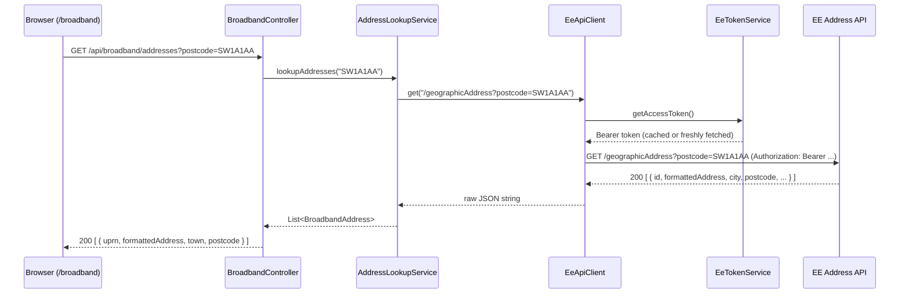
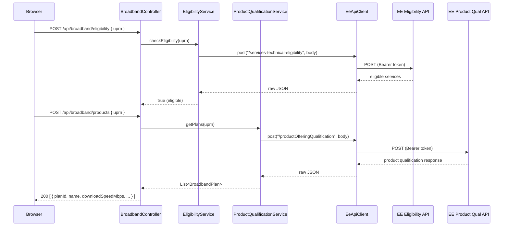
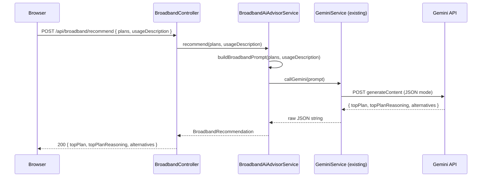
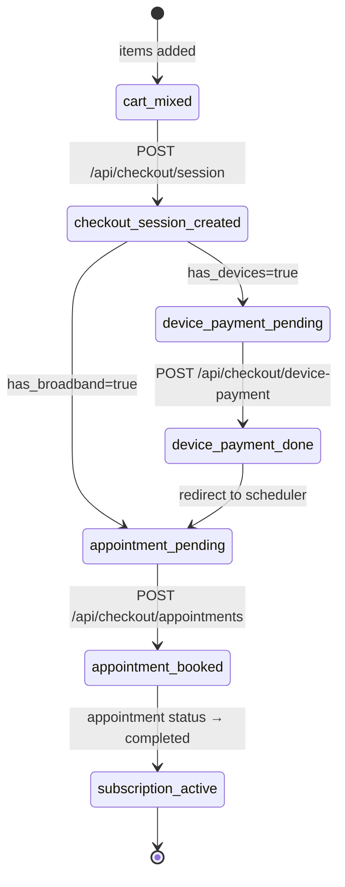

# Design Document: Broadband Checker

## Overview

The Broadband Checker is a new page (`/broadband`) in the existing AI.Shop Next.js application. It allows users to enter a UK postcode, select their address, view available broadband plans fetched from the EE API suite, and receive AI-powered recommendations via Gemini.

All EE API calls are proxied through the existing Spring Boot backend (`shopping-agent-backend`). The frontend uses the existing `apiClient` pattern. A self-contained AI advisor panel is embedded in the page — separate from the existing shopping chat panel — and calls the Gemini API via the backend.

OAuth tokens for the EE API are acquired and cached server-side using the client credentials flow. Credentials never reach the browser.

---

## Architecture

```mermaid
graph TD
    subgraph Browser
        A[/broadband page] -->|apiClient calls| B[Next.js API routes / direct fetch]
    end

    subgraph Spring Boot Backend
        C[BroadbandController] --> D[AddressLookupService]
        C --> E[EligibilityService]
        C --> F[ProductQualificationService]
        C --> G[BroadbandAiAdvisorService]
        D & E & F --> H[EeApiClient]
        H --> I[EeTokenService]
        G --> J[GeminiService existing]
    end

    subgraph EE APIs
        K[Geographic Address API]
        L[Technical Eligibility API]
        M[Product Offering Qualification API]
    end

    B -->|GET /api/broadband/addresses| C
    B -->|POST /api/broadband/eligibility| C
    B -->|POST /api/broadband/products| C
    B -->|POST /api/broadband/recommend| C

    H -->|OAuth Bearer| K
    H -->|OAuth Bearer| L
    H -->|OAuth Bearer| M

    I -->|POST /oauth/token| N[APIGEE Token Endpoint]
```

### Key Design Decisions

- **Single BroadbandController** handles all four broadband endpoints, delegating to focused service classes. This mirrors the existing controller-per-domain pattern.
- **EeApiClient** is a shared HTTP client wrapper that injects the OAuth Bearer token on every outbound request. All three EE service classes depend on it rather than managing HTTP themselves.
- **EeTokenService** holds a single cached token with an expiry timestamp. It refreshes proactively when the token is within 30 seconds of expiry. This avoids per-request token fetches while handling expiry gracefully.
- **BroadbandAiAdvisorService** reuses the existing `GeminiService` infrastructure (same `HttpClient`, same API key config) but constructs a broadband-specific prompt rather than a shopping prompt.
- The frontend `/broadband` page is a standard Next.js App Router page component. It does not use the existing `AiChatPanel` — it has its own inline advisor panel to keep the UX self-contained.

---

## Components and Interfaces

### Backend — New Classes

#### `BroadbandController`
```
GET  /api/broadband/addresses?postcode={postcode}
POST /api/broadband/eligibility          body: { "uprn": "..." }
POST /api/broadband/products             body: { "uprn": "..." }
POST /api/broadband/recommend            body: { "plans": [...], "usageDescription": "..." }
```

#### `EeTokenService`
```java
// Acquires and caches an OAuth2 client-credentials token for the EE API.
// Refreshes automatically when within 30s of expiry.
String getAccessToken();
```

#### `EeApiClient`
```java
// Thin wrapper around Java HttpClient that injects Bearer tokens.
String get(String url);
String post(String url, String jsonBody);
```

#### `AddressLookupService`
```java
List<BroadbandAddress> lookupAddresses(String postcode);
```

#### `EligibilityService`
```java
boolean checkEligibility(String uprn);
```

#### `ProductQualificationService`
```java
List<BroadbandPlan> getPlans(String uprn);
```

#### `BroadbandAiAdvisorService`
```java
BroadbandRecommendation recommend(List<BroadbandPlan> plans, String usageDescription);
```

### Backend — New Models

#### `BroadbandAddress`
```java
String uprn;
String formattedAddress;
String town;
String postcode;
```

#### `BroadbandPlan`
```java
String planId;
String name;
int downloadSpeedMbps;
int uploadSpeedMbps;
String technologyType;   // FTTP, FTTC, SOGEA, etc.
int contractLengthMonths;
double monthlyPrice;
String promotionalLabel; // nullable
```

#### `BroadbandRecommendation`
```java
BroadbandPlan topPlan;
String topPlanReasoning;
List<AlternativePlan> alternatives; // max 2
```

#### `AlternativePlan`
```java
BroadbandPlan plan;
String reasoning;
```

#### `BroadbandErrorResponse`
```java
String message;
int status;
```

### Frontend — New Files

| File | Purpose |
|---|---|
| `src/app/broadband/page.tsx` | Main `/broadband` route page |
| `src/components/broadband/PostcodeForm.tsx` | Postcode input + Find Address button |
| `src/components/broadband/AddressDropdown.tsx` | Address selector dropdown |
| `src/components/broadband/PlanCard.tsx` | Single broadband plan card |
| `src/components/broadband/PlanList.tsx` | Sorted plan list with count header |
| `src/components/broadband/BroadbandAdvisor.tsx` | Inline AI advisor panel |
| `src/types/broadband.ts` | TypeScript types mirroring backend models |

### Frontend — `apiClient` additions (`src/lib/api-client.ts`)

```typescript
async getAddresses(postcode: string): Promise<BroadbandAddress[]>
async checkEligibilityAndGetPlans(uprn: string): Promise<BroadbandPlan[]>
async getBroadbandRecommendation(plans: BroadbandPlan[], usageDescription: string): Promise<BroadbandRecommendation>
```

---

## Data Models

### TypeScript types (`src/types/broadband.ts`)

```typescript
export interface BroadbandAddress {
  uprn: string;
  formattedAddress: string;
  town: string;
  postcode: string;
}

export interface BroadbandPlan {
  planId: string;
  name: string;
  downloadSpeedMbps: number;
  uploadSpeedMbps: number;
  technologyType: string;
  contractLengthMonths: number;
  monthlyPrice: number;
  promotionalLabel?: string;
}

export interface AlternativePlan {
  plan: BroadbandPlan;
  reasoning: string;
}

export interface BroadbandRecommendation {
  topPlan: BroadbandPlan;
  topPlanReasoning: string;
  alternatives: AlternativePlan[];
}
```

### EE API → `BroadbandAddress` mapping

The EE Geographic Address API returns an array of address objects. The relevant fields are:

| EE field | `BroadbandAddress` field |
|---|---|
| `id` | `uprn` |
| `formattedAddress` | `formattedAddress` |
| `city` | `town` |
| `postcode` | `postcode` |

Unknown fields are ignored via Gson's default behaviour (no `@SerializedName` required for unknown fields; Jackson's `@JsonIgnoreProperties(ignoreUnknown = true)` if Jackson is used).

### EE API → `BroadbandPlan` mapping

The EE Product Offering Qualification API returns a `productOfferingQualification` array. Each item contains a `productOffering` object:

| EE field path | `BroadbandPlan` field |
|---|---|
| `productOffering.id` | `planId` |
| `productOffering.name` | `name` |
| `productOffering.characteristic[name=downloadSpeed].value` | `downloadSpeedMbps` |
| `productOffering.characteristic[name=uploadSpeed].value` | `uploadSpeedMbps` |
| `productOffering.characteristic[name=technologyType].value` | `technologyType` |
| `productOffering.characteristic[name=contractLength].value` | `contractLengthMonths` |
| `productOffering.price[priceType=recurring].price.taxIncludedAmount.value` | `monthlyPrice` |
| `productOffering.characteristic[name=promotionalLabel].value` | `promotionalLabel` (nullable) |

### OAuth Token model (internal, not exposed)

```java
// Held in EeTokenService — never serialised to a response
String accessToken;
Instant expiresAt;
```

---

## Data Flow Diagrams

### Address Lookup Flow



### Plan Retrieval Flow



### AI Recommendation Flow



---

## OAuth Token Acquisition and Caching

`EeTokenService` implements a simple in-memory cache:

```
state: { token: String, expiresAt: Instant }

getAccessToken():
  if token != null AND now < expiresAt - 30s:
    return token
  else:
    POST https://api-test2.ee.co.uk/oauth/token
      grant_type=client_credentials
      client_id=${ee.api.clientId}
      client_secret=${ee.api.clientSecret}
    parse { access_token, expires_in }
    store token = access_token
    store expiresAt = now + expires_in seconds
    return token
```

Configuration properties added to `application.properties`:

```properties
ee.api.base-url=https://api-test2.ee.co.uk
ee.api.client-id=n5xdFTEN6BpTcF96PcsSGEJ2UGo1bLpH
ee.api.client-secret=${EE_API_CLIENT_SECRET}
ee.api.token-url=https://api-test2.ee.co.uk/oauth/token
```

The client secret is injected via environment variable (`EE_API_CLIENT_SECRET`) and never hardcoded. The token is stored only in the JVM heap — it is never written to a response body, log line, or database.

---

## AI Prompt Design

`BroadbandAiAdvisorService.buildBroadbandPrompt` constructs a compact system prompt:

```
You are a broadband advisor for AI.Shop. Respond ONLY in JSON.

AVAILABLE PLANS:
{planId}:{name}|down:{downloadSpeedMbps}Mbps|up:{uploadSpeedMbps}Mbps|tech:{technologyType}|contract:{contractLengthMonths}mo|price:£{monthlyPrice}/mo[|promo:{promotionalLabel}]
... (one line per plan)

USER NEEDS: {usageDescription}

OUTPUT FORMAT:
{
  "topPlan": { <full BroadbandPlan object> },
  "topPlanReasoning": "Plain English explanation (2-3 sentences)",
  "alternatives": [
    { "plan": { <BroadbandPlan> }, "reasoning": "1 sentence" },
    { "plan": { <BroadbandPlan> }, "reasoning": "1 sentence" }
  ]
}

RULES:
- topPlan must be one of the plans listed above
- alternatives must be different from topPlan and from each other
- reasoning must reference the user's stated needs
- If fewer than 3 plans exist, alternatives may have fewer than 2 entries
- Respond with valid JSON only, no markdown fences
```

The response is parsed with Gson into `BroadbandRecommendation`. If parsing fails or Gemini returns an error, `BroadbandAiAdvisorService` throws a `BroadbandAiException` which the controller maps to a 503 with a fallback message.

---

## Error Handling

### Backend error mapping

| Scenario | HTTP status | Response body |
|---|---|---|
| Postcode < 5 or > 8 chars | 400 | `{ "message": "Invalid postcode format" }` |
| EE API 4xx | 400 | `{ "message": "Address lookup failed: <EE message>" }` |
| EE API 5xx | 502 | `{ "message": "EE service temporarily unavailable" }` |
| No addresses found | 200 | `[]` (empty array) |
| No eligible services | 200 | `{ "eligible": false }` |
| Gemini error / rate limit | 503 | `{ "message": "AI recommendations temporarily unavailable" }` |
| Gemini timeout (>10s) | 504 | `{ "message": "AI recommendation timed out, please retry" }` |
| Token acquisition failure | 502 | `{ "message": "Unable to authenticate with EE API" }` |

A `@ControllerAdvice` `BroadbandExceptionHandler` handles `BroadbandApiException` and `BroadbandAiException` and maps them to the above responses.

### Frontend error handling

Each `apiClient` method throws on non-OK responses. The `/broadband` page component catches errors in each async step and sets discrete error state variables:

- `addressError` — shown below the postcode form
- `plansError` — shown in place of the plan list
- `advisorError` — shown in the advisor panel, plan list remains visible

Loading states (`addressLoading`, `plansLoading`, `advisorLoading`) drive spinner visibility per requirement 2.6.

---

## Testing Strategy

### Dual approach

Both unit/example tests and property-based tests are required. Unit tests cover specific examples, integration points, and error conditions. Property tests verify universal invariants across generated inputs.

### Property-based testing

The project uses **jqwik** (already present in the test classpath based on `PromotionProductRelationshipProperties`). Each property test runs a minimum of **100 iterations** (`@Property(tries = 100)`).

Each test is tagged with a comment in the format:
`// Feature: broadband-checker, Property N: <property text>`

### Unit tests (examples)

- `BroadbandControllerTest` — MockMvc tests for each endpoint: happy path, 400 on bad postcode, 502 on EE error
- `EeTokenServiceTest` — token caching: cached token returned on second call, refresh triggered near expiry
- `AddressLookupServiceTest` — EE JSON → `BroadbandAddress` mapping with a known fixture
- `ProductQualificationServiceTest` — EE JSON → `BroadbandPlan` mapping with a known fixture
- `BroadbandAiAdvisorServiceTest` — Gemini error returns fallback, timeout returns 504
- Frontend: React Testing Library tests for `PostcodeForm` (renders input/button), `PlanCard` (renders all fields), `BroadbandAdvisor` (renders usage input)

---

## Correctness Properties

*A property is a characteristic or behavior that should hold true across all valid executions of a system — essentially, a formal statement about what the system should do. Properties serve as the bridge between human-readable specifications and machine-verifiable correctness guarantees.*

### Property 1: Postcode length validation rejects out-of-range inputs

*For any* string whose length is less than 5 or greater than 8 characters, the postcode validation function should return an error and the EE address API should not be called.

**Validates: Requirements 1.2**

---

### Property 2: Plan card renders all required fields

*For any* valid `BroadbandPlan` object, the rendered plan card string/HTML should contain the plan name, download speed, upload speed, technology type, contract length, and monthly price.

**Validates: Requirements 3.1**

---

### Property 3: Plan list is sorted by price ascending

*For any* non-empty list of `BroadbandPlan` objects, after applying the sort function, each plan's `monthlyPrice` should be less than or equal to the next plan's `monthlyPrice`.

**Validates: Requirements 3.2**

---

### Property 4: Promotional label appears when present

*For any* `BroadbandPlan` with a non-null, non-empty `promotionalLabel`, the rendered plan card should contain that label string.

**Validates: Requirements 3.3**

---

### Property 5: Plan count display equals list length

*For any* list of `BroadbandPlan` objects, the count value rendered above the plan list should equal the size of the list.

**Validates: Requirements 3.4**

---

### Property 6: EE API credentials never appear in responses

*For any* broadband endpoint response (addresses, eligibility, products, recommend), the serialised response body should not contain the configured EE client ID or client secret strings.

**Validates: Requirements 5.4**

---

### Property 7: EE API errors propagate as non-2xx to the frontend

*For any* HTTP 4xx or 5xx response from the EE API, the Spring Boot backend should return a response with an HTTP status code outside the 200–299 range to the frontend caller.

**Validates: Requirements 5.5**

---

### Property 8: BroadbandAddress round-trip serialisation

*For any* valid `BroadbandAddress` object, serialising it to JSON with Gson and then deserialising the resulting JSON string back to a `BroadbandAddress` should produce an object equal to the original (same `uprn`, `formattedAddress`, `town`, `postcode`).

**Validates: Requirements 8.1, 8.3**

---

### Property 9: BroadbandPlan round-trip serialisation

*For any* valid `BroadbandPlan` object, serialising it to JSON with Gson and then deserialising the resulting JSON string back to a `BroadbandPlan` should produce an object equal to the original across all fields (`planId`, `name`, `downloadSpeedMbps`, `uploadSpeedMbps`, `technologyType`, `contractLengthMonths`, `monthlyPrice`, `promotionalLabel`).

**Validates: Requirements 8.2, 8.4, 8.5**

---

### Property 10: Unknown fields in EE response are silently ignored

*For any* valid `BroadbandPlan` or `BroadbandAddress` JSON object with additional unknown fields injected, parsing should succeed and produce a valid object with all known fields correctly populated, without throwing an exception.

**Validates: Requirements 8.6**


---

## Unified Cart and Split Checkout Flow

### User Journey

The cart can hold both device items (e.g. iPhone) and broadband service items simultaneously. At checkout they are split into two parallel tracks:

1. User adds iPhone + Broadband package to cart
2. Checkout summary shows:
   - "Pay £799 for iPhone (ships tomorrow)"
   - "Schedule broadband installation (pay after successful setup)"
3. Device payment: one-time payment processed for device items only
4. Success page:
   - "iPhone ordered! Arrives Tuesday"
   - "Now let's schedule your broadband installation"
5. Appointment scheduling: calendar picker for installation slot
6. Confirmation: "Installation booked for Friday. Your first broadband payment is due after successful setup"

### Checkout Flow State Machine



### Database Changes

Applied via `broadband-cart-migration.sql`. Summary of schema extensions:

**`cart_items` extended with:**
- `item_type`: `'device' | 'broadband_service'`
- `fulfillment_type`: `'shipping' | 'installation'`
- `broadband_ref`: FK → `user_selections` (service items only)
- `product_id`: now nullable (service items have no product row)
- `unit_price`, `display_name`, `display_summary`: snapshot fields

**`orders` extended with:**
- `order_type`: `'device' | 'service' | 'mixed'`
- `one_time_total`: sum of device prices
- `monthly_total`: sum of broadband subscription prices
- `service_status`: `'pending_appointment' | 'appointment_booked' | 'installation_scheduled' | 'active' | 'cancelled'`

**New tables:**
- `appointments`: installation slot booking — `preferred_date`, `preferred_time_slot`, `confirmed_date`, engineer details, status lifecycle
- `subscriptions`: ongoing monthly subscription, created when appointment status → `'completed'`
- `checkout_sessions`: split-checkout state tracker — `has_devices`, `has_broadband_service`, `device_payment_done`, `appointment_booked`, `status`

### Backend Components

#### `CheckoutController` — new endpoints

```
POST /api/checkout/session                        — create/get checkout session for cart
POST /api/checkout/device-payment                 — process device payment (Stripe/mock)
POST /api/checkout/appointments                   — book installation appointment
GET  /api/checkout/appointments/{id}              — get appointment status
GET  /api/checkout/subscriptions/{sessionId}      — get subscription status
```

#### `CheckoutService`

```java
CheckoutSession buildCheckoutSession(String sessionId);
// splits cart into device items + service items
// calculates one_time_total and monthly_total

Order processDevicePayment(String sessionId, PaymentDetails payment);
Appointment bookAppointment(String sessionId, AppointmentRequest request);
Subscription activateSubscription(String appointmentId);
```

#### `AppointmentService`

```java
List<TimeSlot> getAvailableSlots(String postcode, LocalDate from, LocalDate to);
Appointment bookSlot(UUID orderId, UUID userSelectionId, AppointmentRequest request);
Appointment updateStatus(UUID appointmentId, String status);
```

### Frontend Components

| File | Purpose |
|---|---|
| `src/app/checkout/page.tsx` | Split checkout page showing both tracks |
| `src/components/checkout/CartSummary.tsx` | Shows device items + service items separately |
| `src/components/checkout/DevicePaymentForm.tsx` | Payment form for device items only |
| `src/components/checkout/AppointmentPicker.tsx` | Calendar/slot picker for installation |
| `src/components/checkout/OrderConfirmation.tsx` | Post-payment success with next steps |
| `src/components/checkout/BroadbandConfirmation.tsx` | Post-appointment confirmation |
| `src/types/checkout.ts` | TypeScript types for checkout, appointment, subscription |

### TypeScript Types (`src/types/checkout.ts`)

```typescript
export type ItemType = 'device' | 'broadband_service';
export type FulfillmentType = 'shipping' | 'installation';
export type ServiceStatus =
  | 'pending_appointment' | 'appointment_booked'
  | 'installation_scheduled' | 'active' | 'cancelled';

export interface CheckoutSession {
  sessionId: string;
  hasDevices: boolean;
  hasBroadbandService: boolean;
  devicePaymentDone: boolean;
  appointmentBooked: boolean;
  oneTimeTotal: number;
  monthlyTotal: number;
  status: 'open' | 'device_paid' | 'complete';
  deviceItems: CheckoutCartItem[];
  serviceItems: CheckoutCartItem[];
}

export interface CheckoutCartItem {
  cartItemId: string;
  itemType: ItemType;
  fulfillmentType: FulfillmentType;
  displayName: string;
  displaySummary?: string;
  unitPrice: number;
  quantity: number;
}

export interface AppointmentRequest {
  sessionId: string;
  preferredDate: string;   // ISO date
  preferredTimeSlot: string;
}

export interface Appointment {
  appointmentId: string;
  orderId: string;
  preferredDate: string;
  preferredTimeSlot: string;
  confirmedDate?: string;
  engineerName?: string;
  status: 'pending' | 'confirmed' | 'completed' | 'cancelled';
}

export interface Subscription {
  subscriptionId: string;
  appointmentId: string;
  status: 'inactive' | 'active' | 'cancelled';
  monthlyPrice: number;
  activatedAt?: string;
}
```

---

### Additional Correctness Properties

### Property 11: Cart split correctness

*For any* cart containing a mix of `device` and `broadband_service` items, `buildCheckoutSession` must place every device item in the device track and every broadband_service item in the service track, with no item appearing in both tracks and no item dropped — the union of both tracks must equal the original cart exactly.

**Validates: Checkout flow — cart partitioning invariant**

---

### Property 12: One-time total calculation

*For any* set of device cart items with arbitrary `unit_price` and `quantity` values, the `one_time_total` in the resulting `CheckoutSession` must equal the exact sum of `unit_price × quantity` for all items where `item_type = 'device'`.

**Validates: Checkout flow — device total invariant**

---

### Property 13: Monthly total calculation

*For any* set of broadband_service cart items with arbitrary `monthly_price` values, the `monthly_total` in the resulting `CheckoutSession` must equal the exact sum of `monthly_price` for all items where `item_type = 'broadband_service'`.

**Validates: Checkout flow — service total invariant**

---

### Property 14: Appointment booking requires service order

*For any* checkout session that does not contain a service order (i.e. `has_broadband_service = false` or no service-type order exists), any attempt to call `bookAppointment` must be rejected with an error and no appointment record must be created.

**Validates: Checkout flow — appointment precondition**

---

### Property 15: Subscription only activates after completed appointment

*For any* subscription record, its status must not be `'active'` unless the linked appointment has `status = 'completed'`. Calling `activateSubscription` on an appointment with any status other than `'completed'` must not produce an active subscription.

**Validates: Checkout flow — subscription lifecycle invariant**
