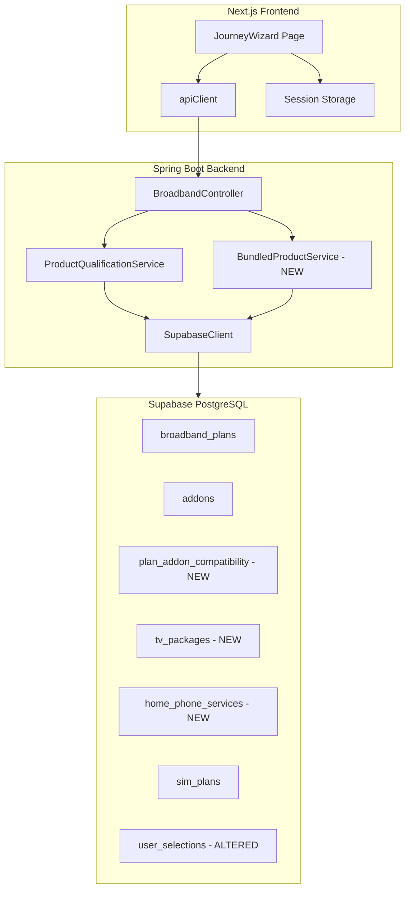
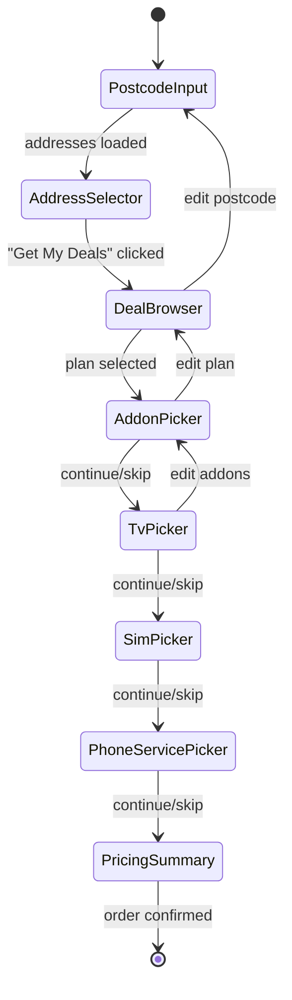

# Design Document: Broadband Purchase Journey

## Overview

This design transforms the existing broadband purchase flow from a single-page dropdown-based UI into a multi-step, card-based wizard. The Journey Wizard orchestrates 8 sequential steps — postcode entry, address selection, deal browsing with filters, add-on selection (plan-type-filtered), TV package selection, SIM plan selection, home phone service selection, and a detailed pricing summary.

The backend requires three new API endpoints (TV packages, SIM plans, home phone services), an update to the existing addons endpoint for plan-type filtering, three new database tables (tv_packages, home_phone_services, plan_addon_compatibility), and schema alterations to user_selections. The frontend introduces a new JourneyWizard component with step-specific sub-components, session-storage-based state persistence, and a responsive card-based layout using the existing inline-style approach.


## Architecture

### System Context

The architecture follows the existing pattern: Next.js frontend → Spring Boot backend → Supabase PostgreSQL.



### Key Design Decisions

1. **Single new service class (BundledProductService)**: TV packages, SIM plans, and home phone services share the same simple fetch-all-active pattern. A single service avoids class proliferation. The existing ProductQualificationService handles the more complex plan-type-filtered addon logic.

2. **Plan-type filtering via junction table**: Rather than adding a `plan_type` column to the addons table (which would require duplicating rows for addons available across multiple plan types), a `plan_addon_compatibility` junction table provides a clean many-to-many relationship.

3. **Frontend state in a useReducer hook**: The wizard state (current step, all selections) lives in a `useReducer` inside JourneyWizard. This is simpler than adding to the global CartContext, which is cart-focused. The wizard syncs to session storage on each step completion and submits to the backend only on order confirmation.

4. **Inline styles**: Consistent with the existing codebase — no CSS modules or Tailwind.

5. **Step reset on back-navigation**: When a user changes a previous selection, all subsequent steps reset. This prevents stale data (e.g., incompatible addons after changing the broadband plan).

## Components and Interfaces

### Database Schema Changes

#### New Table: tv_packages

```sql
CREATE TABLE tv_packages (
    id UUID PRIMARY KEY DEFAULT gen_random_uuid(),
    name TEXT NOT NULL UNIQUE,
    description TEXT,
    monthly_price NUMERIC(10, 2) NOT NULL,
    channel_count INTEGER NOT NULL,
    is_active BOOLEAN DEFAULT true,
    created_at TIMESTAMPTZ DEFAULT now()
);
```

#### New Table: home_phone_services

```sql
CREATE TABLE home_phone_services (
    id UUID PRIMARY KEY DEFAULT gen_random_uuid(),
    name TEXT NOT NULL UNIQUE,
    description TEXT,
    monthly_price NUMERIC(10, 2) NOT NULL,
    includes_calls_to TEXT,
    is_active BOOLEAN DEFAULT true,
    created_at TIMESTAMPTZ DEFAULT now()
);
```

#### New Table: plan_addon_compatibility

```sql
CREATE TABLE plan_addon_compatibility (
    id UUID PRIMARY KEY DEFAULT gen_random_uuid(),
    plan_type TEXT NOT NULL CHECK (plan_type IN ('Core', 'Standard', 'Premium', 'Ultimate')),
    addon_id UUID NOT NULL REFERENCES addons(id) ON DELETE CASCADE,
    UNIQUE (plan_type, addon_id)
);

CREATE INDEX idx_pac_plan_type ON plan_addon_compatibility(plan_type);
CREATE INDEX idx_pac_addon_id ON plan_addon_compatibility(addon_id);
```

#### Altered Table: user_selections

```sql
-- Drop old columns
ALTER TABLE user_selections DROP COLUMN IF EXISTS selected_tv_package;
ALTER TABLE user_selections DROP COLUMN IF EXISTS selected_home_phone;

-- Add new FK columns
ALTER TABLE user_selections
    ADD COLUMN selected_tv_package_id UUID REFERENCES tv_packages(id),
    ADD COLUMN selected_home_phone_service_id UUID REFERENCES home_phone_services(id);
```

#### Seed Data

```sql
-- TV Packages
INSERT INTO tv_packages (name, description, monthly_price, channel_count) VALUES
  ('Entertainment', 'Freeview channels plus catch-up TV apps', 0.00, 80),
  ('Big Entertainment', 'Sky Atlantic, Comedy Central, MTV and 100+ channels', 12.00, 150),
  ('VIP', 'All channels including Sky Sports, Cinema, and BT Sport', 25.00, 230);

-- Home Phone Services
INSERT INTO home_phone_services (name, description, monthly_price, includes_calls_to) VALUES
  ('Pay As You Go', 'Pay per call with no monthly commitment', 0.00, 'N/A — charged per call'),
  ('Unlimited UK Calls', 'Unlimited calls to UK landlines and mobiles', 8.00, 'UK landlines and mobiles'),
  ('Unlimited UK & International', 'Unlimited calls to UK and 50+ international destinations', 12.00, 'UK landlines, mobiles, and 50+ countries');

-- Plan-Addon Compatibility
-- WiFi Extender, Complete WiFi, Norton Security, International Calls → all plan types
-- BT Sport, EE TV, Static IP → Premium and Ultimate only
INSERT INTO plan_addon_compatibility (plan_type, addon_id)
SELECT pt.plan_type, a.id
FROM (VALUES ('Core'), ('Standard'), ('Premium'), ('Ultimate')) AS pt(plan_type)
CROSS JOIN addons a
WHERE a.name IN ('WiFi Extender', 'Complete WiFi', 'Norton Security', 'International Calls');

INSERT INTO plan_addon_compatibility (plan_type, addon_id)
SELECT pt.plan_type, a.id
FROM (VALUES ('Premium'), ('Ultimate')) AS pt(plan_type)
CROSS JOIN addons a
WHERE a.name IN ('BT Sport', 'EE TV', 'Static IP Address');
```

#### Seed Data: Address Technology Variation

The existing seed data in `addresses` provides varied technology coverage across postcodes for testing the technology-based plan filtering:

| Location | technology_copper | technology_fttp | technology_sogea | Expected plans |
|---|---|---|---|---|
| Swansea (SA1 6AU) | true | false | false | SOGEA, FTTC only |
| London (SW1A 1AA) | false | true | true | SOGEA, FTTC, FTTP |
| Manchester (M1 1AE) | true | true | true | SOGEA, FTTC, FTTP |
| Birmingham (B1 1BB) | true | false | true | SOGEA, FTTC only |

Testing with different postcodes will show different plan sets, validating the technology filtering logic.


### Backend API Changes

#### Updated Endpoint: GET /api/broadband/addons

Add optional `planType` query parameter to the existing endpoint.

**Controller change** in `BroadbandController.java`:
```java
@GetMapping("/addons")
public ResponseEntity<?> getAddons(
        @RequestParam(required = false) String planType) {
    if (planType != null && !List.of("Core", "Standard", "Premium", "Ultimate").contains(planType)) {
        return ResponseEntity.badRequest()
            .body(Map.of("error", "Invalid planType. Must be Core, Standard, Premium, or Ultimate."));
    }
    List<Map<String, Object>> addons = productQualificationService.getAddons(planType);
    return ResponseEntity.ok(addons);
}
```

**Service change** in `ProductQualificationService.java`:
```java
public List<Map<String, Object>> getAddons(String planType) {
    String query;
    if (planType != null) {
        // Join through plan_addon_compatibility to filter by plan type
        query = "select=addon_id,addons(id,name,monthly_price,description)"
              + "&plan_type=eq." + planType
              + "&addons.is_active=eq.true";
        // Query plan_addon_compatibility table, then extract addon data
    } else {
        query = "select=id,name,monthly_price,description&is_active=eq.true";
        // Query addons table directly (backward compatible)
    }
    // ... parse and return
}
```

When `planType` is provided, the service queries `plan_addon_compatibility` with an embedded select on the `addons` foreign key, filtering by `plan_type=eq.{planType}`. When omitted, it queries the `addons` table directly (preserving backward compatibility).

#### New Endpoint: GET /api/broadband/tv-packages

Returns all active TV packages.

```java
@GetMapping("/tv-packages")
public ResponseEntity<List<Map<String, Object>>> getTvPackages() {
    return ResponseEntity.ok(bundledProductService.getTvPackages());
}
```

**Response shape:**
```json
[
  {
    "id": "uuid",
    "name": "Big Entertainment",
    "description": "Sky Atlantic, Comedy Central...",
    "monthlyPrice": 12.00,
    "channelCount": 150
  }
]
```

#### New Endpoint: GET /api/broadband/sim-plans

Returns all active SIM plans.

```java
@GetMapping("/sim-plans")
public ResponseEntity<List<Map<String, Object>>> getSimPlans() {
    return ResponseEntity.ok(bundledProductService.getSimPlans());
}
```

**Response shape:**
```json
[
  {
    "id": "uuid",
    "name": "Unlimited Standard",
    "monthlyPrice": 15.00,
    "maxSpeed": "60Mbps",
    "description": "Unlimited data at 60Mbps...",
    "isUnlimited": true
  }
]
```

#### New Endpoint: GET /api/broadband/home-phone-services

Returns all active home phone services.

```java
@GetMapping("/home-phone-services")
public ResponseEntity<List<Map<String, Object>>> getHomePhoneServices() {
    return ResponseEntity.ok(bundledProductService.getHomePhoneServices());
}
```

**Response shape:**
```json
[
  {
    "id": "uuid",
    "name": "Unlimited UK Calls",
    "description": "Unlimited calls to UK landlines and mobiles",
    "monthlyPrice": 8.00,
    "includesCallsTo": "UK landlines and mobiles"
  }
]
```

#### New Service: BundledProductService.java

A single service class for fetching TV packages, SIM plans, and home phone services. All three follow the same pattern: query the respective table for active records, map snake_case columns to camelCase response fields.

```java
@Service
public class BundledProductService {
    private final SupabaseClient supabaseClient;
    private final Gson gson = new Gson();

    public List<Map<String, Object>> getTvPackages() {
        String json = supabaseClient.get("tv_packages",
            "select=id,name,description,monthly_price,channel_count&is_active=eq.true");
        // parse and return with camelCase keys
    }

    public List<Map<String, Object>> getSimPlans() {
        String json = supabaseClient.get("sim_plans",
            "select=id,name,monthly_price,max_speed,description,is_unlimited&is_active=eq.true");
        // parse and return with camelCase keys
    }

    public List<Map<String, Object>> getHomePhoneServices() {
        String json = supabaseClient.get("home_phone_services",
            "select=id,name,description,monthly_price,includes_calls_to&is_active=eq.true");
        // parse and return with camelCase keys
    }
}
```

### Frontend Components

#### New TypeScript Interfaces (src/types/broadband.ts additions)

```typescript
export interface BroadbandPlan {
  planId: string;
  name: string;
  downloadSpeedMbps: number;
  uploadSpeedMbps: number;
  planType: string;           // NEW: Core | Standard | Premium | Ultimate
  technologyType: string;
  contractLengthMonths: number;
  monthlyPrice: number;
  promotionalLabel?: string;
  includesRouter: boolean;    // NEW
  routerName?: string;        // NEW
  speedGuaranteeMbps?: number;// NEW
  activationFee: number;      // NEW
  outOfContractPrice?: number;// NEW
}

export interface TvPackage {
  id: string;
  name: string;
  description: string;
  monthlyPrice: number;
  channelCount: number;
}

export interface SimPlan {
  id: string;
  name: string;
  monthlyPrice: number;
  maxSpeed: string;
  description: string;
  isUnlimited: boolean;
}

export interface HomePhoneService {
  id: string;
  name: string;
  description: string;
  monthlyPrice: number;
  includesCallsTo: string;
}
```

#### Journey State (useReducer)

```typescript
interface JourneyState {
  currentStep: number;
  postcode: string | null;
  addresses: BroadbandAddress[];
  selectedAddress: BroadbandAddress | null;
  plans: BroadbandPlan[];
  selectedPlan: BroadbandPlan | null;
  selectedAddons: BroadbandAddon[];
  tvPackages: TvPackage[];
  selectedTvPackage: TvPackage | null;
  simPlans: SimPlan[];
  selectedSimPlan: SimPlan | null;
  homePhoneServices: HomePhoneService[];
  selectedHomePhoneService: HomePhoneService | null;
  loading: boolean;
  error: string | null;
}
```

Actions: `SET_POSTCODE`, `SET_ADDRESSES`, `SELECT_ADDRESS`, `SET_PLANS`, `SELECT_PLAN`, `SET_ADDONS_LIST`, `TOGGLE_ADDON`, `SET_TV_PACKAGES`, `SELECT_TV_PACKAGE`, `SET_SIM_PLANS`, `SELECT_SIM_PLAN`, `SET_HOME_PHONE_SERVICES`, `SELECT_HOME_PHONE_SERVICE`, `GO_TO_STEP`, `RESET_FROM_STEP`, `SET_LOADING`, `SET_ERROR`, `RESTORE_STATE`.

The `RESET_FROM_STEP` action clears all selections from the given step onward, implementing the back-navigation reset requirement.

#### Component Tree

```
src/
├── app/broadband/page.tsx              ← New page route
├── components/broadband/
│   ├── JourneyWizard.tsx               ← Orchestrator with useReducer + session storage
│   ├── StepProgressBar.tsx             ← Step indicator (step number, name, total)
│   ├── StepCard.tsx                    ← Wrapper: collapsed summary vs active content
│   ├── PostcodeInput.tsx               ← Step 1: postcode entry + validation
│   ├── AddressSelector.tsx             ← Step 2: address cards + "Get My Deals" button
│   ├── DealBrowser.tsx                 ← Step 3: plan cards + FilterBar
│   ├── FilterBar.tsx                   ← Speed tier / contract / plan type filters
│   ├── AddonPicker.tsx                 ← Step 4: plan-type-filtered addon cards
│   ├── TvPicker.tsx                    ← Step 5: TV package cards
│   ├── SimPicker.tsx                   ← Step 6: SIM plan cards
│   ├── PhoneServicePicker.tsx          ← Step 7: home phone service cards
│   └── PricingSummary.tsx              ← Step 8: full price breakdown + confirm
```

#### API Client Additions (src/lib/api-client.ts)

```typescript
async getAddons(planType?: string): Promise<BroadbandAddon[]> {
  const params = planType ? `?planType=${encodeURIComponent(planType)}` : '';
  const res = await fetch(`${API_URL}/api/broadband/addons${params}`);
  if (!res.ok) throw new Error('Failed to fetch addons');
  return res.json();
},

async getTvPackages(): Promise<TvPackage[]> {
  const res = await fetch(`${API_URL}/api/broadband/tv-packages`);
  if (!res.ok) throw new Error('Failed to fetch TV packages');
  return res.json();
},

async getSimPlans(): Promise<SimPlan[]> {
  const res = await fetch(`${API_URL}/api/broadband/sim-plans`);
  if (!res.ok) throw new Error('Failed to fetch SIM plans');
  return res.json();
},

async getHomePhoneServices(): Promise<HomePhoneService[]> {
  const res = await fetch(`${API_URL}/api/broadband/home-phone-services`);
  if (!res.ok) throw new Error('Failed to fetch home phone services');
  return res.json();
},

async submitUserSelection(selection: UserSelectionPayload): Promise<void> {
  const res = await fetch(`${API_URL}/api/broadband/user-selections`, {
    method: 'POST',
    headers: { 'Content-Type': 'application/json' },
    body: JSON.stringify(selection),
  });
  if (!res.ok) throw new Error('Failed to submit order');
}
```

#### Session Storage Strategy

The `JourneyWizard` component persists state to `sessionStorage` under the key `broadband-journey-state` after each step completion. On mount, it checks for existing state and restores it via the `RESTORE_STATE` action. On order confirmation or explicit "Start New Journey", it clears the key.

Serialization: `JSON.stringify(state)` / `JSON.parse(stored)`. Only serializable data is stored (no functions or DOM refs).


## Data Models

### Backend Models

#### Extended BroadbandPlan.java

The existing `BroadbandPlan` model needs additional fields to support the pricing summary:

```java
@Data
@NoArgsConstructor
@AllArgsConstructor
public class BroadbandPlan {
    private String planId;
    private String name;
    private int downloadSpeedMbps;
    private int uploadSpeedMbps;
    private String planType;            // NEW
    private String technologyType;
    private int contractLengthMonths;
    private double monthlyPrice;
    private String promotionalLabel;
    private boolean includesRouter;     // NEW
    private String routerName;          // NEW
    private int speedGuaranteeMbps;     // NEW
    private double activationFee;       // NEW
    private double outOfContractPrice;  // NEW
}
```

The `ProductQualificationService.getPlans()` query must be updated to select these additional columns from `broadband_plans`.

#### Technology-Based Plan Filtering in ProductQualificationService.getPlans()

The `getPlans(String uprn)` method must filter broadband plans based on the technologies available at the selected address. The implementation:

1. Look up the address record by UPRN from the `addresses` table to retrieve the technology flags: `technology_copper`, `technology_fttp`, `technology_sogea`.
2. Build a list of compatible technology types based on the flags:
   - If `technology_copper = true` OR `technology_sogea = true` → include `'SOGEA'` and `'FTTC'` plans
   - If `technology_fttp = true` → include `'FTTP'` plans
3. Query `broadband_plans` filtered by `is_active=eq.true` and `technology_type=in.(compatible_types)`.
4. If the address is not found or has no technology flags set, return an empty list.

**Technology Mapping Table:**

| Plan technology_type | Required address flag |
|---|---|
| SOGEA | technology_sogea=true OR technology_copper=true |
| FTTC | technology_sogea=true OR technology_copper=true |
| FTTP | technology_fttp=true |

**Example:** A London address (FTTP + SOGEA, no copper) would see SOGEA, FTTC, and FTTP plans. A Swansea address (copper only) would see SOGEA and FTTC plans but not FTTP plans.

```java
public List<BroadbandPlan> getPlans(String uprn) {
    // 1. Look up address by UPRN
    String addressJson = supabaseClient.get("addresses",
        "select=technology_copper,technology_fttp,technology_sogea&uprn=eq." + uprn);
    // Parse address technology flags

    // 2. Build compatible technology types list
    List<String> compatibleTypes = new ArrayList<>();
    if (technologyCopper || technologySogea) {
        compatibleTypes.add("SOGEA");
        compatibleTypes.add("FTTC");
    }
    if (technologyFttp) {
        compatibleTypes.add("FTTP");
    }
    if (compatibleTypes.isEmpty()) return List.of();

    // 3. Query plans filtered by compatible technology types
    String techFilter = "technology_type=in.(" + String.join(",", compatibleTypes) + ")";
    String json = supabaseClient.get(PLANS_TABLE,
        "select=...&is_active=eq.true&" + techFilter);
    // Parse and return plans
}
```

#### TvPackage.java (NEW)

```java
@Data
@NoArgsConstructor
@AllArgsConstructor
public class TvPackage {
    private String id;
    private String name;
    private String description;
    private double monthlyPrice;
    private int channelCount;
}
```

#### HomePhoneService.java (NEW)

```java
@Data
@NoArgsConstructor
@AllArgsConstructor
public class HomePhoneService {
    private String id;
    private String name;
    private String description;
    private double monthlyPrice;
    private String includesCallsTo;
}
```

#### SimPlan.java (NEW)

```java
@Data
@NoArgsConstructor
@AllArgsConstructor
public class SimPlan {
    private String id;
    private String name;
    private double monthlyPrice;
    private String maxSpeed;
    private String description;
    private boolean isUnlimited;
}
```

#### UserSelectionPayload.java (NEW)

Used for the order submission endpoint:

```java
@Data
@NoArgsConstructor
@AllArgsConstructor
public class UserSelectionPayload {
    private String sessionId;
    private String postcodeId;
    private String addressId;
    private String selectedPlanId;
    private List<String> selectedAddonIds;
    private String selectedTvPackageId;     // nullable
    private String selectedSimPlanId;       // nullable
    private String selectedHomePhoneServiceId; // nullable
    private double totalMonthlyPrice;
}
```

### Frontend State Flow



### Price Calculation Model

The pricing summary computes:

```typescript
interface PriceBreakdown {
  broadband: {
    planName: string;
    monthlyPrice: number;
    activationFee: number;
    routerName: string;
    routerIncluded: boolean;
    contractLengthMonths: number;
    outOfContractPrice?: number;
  };
  addons: Array<{ name: string; monthlyPrice: number }>;
  addonsSubtotal: number;
  tvPackage?: { name: string; monthlyPrice: number };
  simPlan?: { name: string; monthlyPrice: number; dataAllowance: string };
  homePhone?: { name: string; monthlyPrice: number };
  oneTimeFees: Array<{ label: string; amount: number }>;
  oneTimeTotal: number;
  monthlyTotal: number;
}
```

`monthlyTotal = broadband.monthlyPrice + addonsSubtotal + (tvPackage?.monthlyPrice ?? 0) + (simPlan?.monthlyPrice ?? 0) + (homePhone?.monthlyPrice ?? 0)`

`oneTimeTotal = sum of all one-time fees (activation fee, router fee if not included)`


## Correctness Properties

*A property is a characteristic or behavior that should hold true across all valid executions of a system — essentially, a formal statement about what the system should do. Properties serve as the bridge between human-readable specifications and machine-verifiable correctness guarantees.*

### Property 1: Single Active Step Invariant

*For any* valid journey state with currentStep = N (where 0 ≤ N < 8), exactly one step (step N) is in the "active" state, all steps with index < N are in the "completed" state, and all steps with index > N are in the "upcoming" state.

**Validates: Requirements 1.1**

### Property 2: Reset From Step Clears Subsequent Selections

*For any* journey state where the user navigates back to step N (where N < currentStep), all selections for steps N+1 through 7 shall be reset to their initial (null/empty) values, and currentStep shall be set to N.

**Validates: Requirements 1.4, 1.5, 5.9**

### Property 3: Postcode Validation

*For any* string, the postcode validation function returns true if and only if the trimmed string length is between 5 and 8 characters (inclusive).

**Validates: Requirements 2.2**

### Property 4: Plan Sort Order

*For any* list of broadband plans, the default sort produces a list where for every consecutive pair (plan[i], plan[i+1]), plan[i].monthlyPrice ≤ plan[i+1].monthlyPrice.

**Validates: Requirements 4.2**

### Property 5: Plan Filter Correctness

*For any* list of broadband plans and any combination of active filters (speed tier, contract length, plan type), every plan in the filtered result matches all active filter criteria, and no plan outside the filtered result matches all active filter criteria.

**Validates: Requirements 4.3, 4.7**

### Property 6: Plan Card Contains Required Fields

*For any* broadband plan, the rendered plan card contains the plan name, download speed, upload speed, technology type, contract length, monthly price, and promotional label (when present).

**Validates: Requirements 4.1**

### Property 7: Addon Compatibility Filtering

*For any* valid plan type (Core, Standard, Premium, Ultimate), the GET /api/broadband/addons?planType={type} endpoint returns only addons that have a corresponding entry in the plan_addon_compatibility table for that plan type, and returns all such addons.

**Validates: Requirements 5.2, 15.5**

### Property 8: Invalid Plan Type Rejection

*For any* string that is not one of "Core", "Standard", "Premium", or "Ultimate", the GET /api/broadband/addons?planType={string} endpoint returns HTTP 400.

**Validates: Requirements 15.7**

### Property 9: Addon Multi-Select Toggle

*For any* list of available addons and any sequence of toggle operations, the set of selected addons after applying all toggles equals the symmetric difference of the initial selection and the toggled addon IDs (i.e., toggling an addon twice returns it to its original state).

**Validates: Requirements 5.4**

### Property 10: Addon Subtotal Accuracy

*For any* set of selected addons, the displayed subtotal equals the sum of the monthlyPrice of each selected addon, computed to two decimal places.

**Validates: Requirements 5.6**

### Property 11: Single-Select Invariant for Optional Services

*For any* sequence of selection actions on TV packages, SIM plans, or home phone services, the state never contains more than one selected item per category. Selecting a new item in the same category replaces the previous selection.

**Validates: Requirements 6.2, 7.2, 8.2**

### Property 12: Optional Service Card Contains Required Fields

*For any* TV package, the rendered card contains name, description, monthly price, and channel count. *For any* SIM plan, the rendered card contains name, data allowance/unlimited status, max speed, description, and monthly price. *For any* home phone service, the rendered card contains name, description, and monthly price.

**Validates: Requirements 6.1, 7.1, 8.1**

### Property 13: Monthly Total Calculation

*For any* combination of a selected broadband plan, zero or more addons, an optional TV package, an optional SIM plan, and an optional home phone service, the monthly total equals: plan.monthlyPrice + sum(addon.monthlyPrice for each selected addon) + (tvPackage?.monthlyPrice ?? 0) + (simPlan?.monthlyPrice ?? 0) + (homePhone?.monthlyPrice ?? 0).

**Validates: Requirements 9.9**

### Property 14: One-Time Fees Calculation

*For any* selected broadband plan, the one-time total equals the sum of all non-zero one-time charges (activation fee, and router fee if the router is not included). The one-time fees section lists each individual charge.

**Validates: Requirements 9.2, 9.8**

### Property 15: Pricing Summary Broadband Section Completeness

*For any* selected broadband plan, the pricing summary broadband section contains the plan name, contract length, monthly price, router name, and router inclusion status. When the plan has an out-of-contract price, a notice displaying that price is shown.

**Validates: Requirements 9.1, 9.3, 9.11**

### Property 16: Pricing Summary Optional Sections

*For any* journey state, the pricing summary displays an "Add-ons" section if and only if at least one addon is selected, a "TV" section if and only if a TV package is selected, a "Mobile" section if and only if a SIM plan is selected, and a "Home Phone" section if and only if a home phone service is selected. Each section shows the correct item details and prices.

**Validates: Requirements 9.4, 9.5, 9.6, 9.7**

### Property 17: Session Storage Round Trip

*For any* valid journey state, serializing the state to session storage and then deserializing it produces a state equal to the original, and the restored currentStep matches the last completed step.

**Validates: Requirements 11.1, 11.2**

### Property 18: Step Progress Indicator Accuracy

*For any* journey state with currentStep = N, the progress indicator displays step number N+1, the correct step name from the fixed order, and total steps = 8.

**Validates: Requirements 10.3**

### Property 19: Seed Data Addon Compatibility Rules

*For any* addon in the seed data, if the addon is WiFi-related (WiFi Extender, Complete WiFi) or a general service (Norton Security, International Calls), it has compatibility entries for all four plan types. If the addon is a premium service (BT Sport, EE TV, Static IP Address), it has compatibility entries only for Premium and Ultimate.

**Validates: Requirements 14.8**

### Property 20: Technology-Based Plan Filtering

*For any* address with a given set of technology flags (technology_copper, technology_fttp, technology_sogea), `getPlans(uprn)` returns only plans whose technology_type is compatible with the address's available technologies. Specifically: SOGEA and FTTC plans are returned only when technology_copper=true OR technology_sogea=true; FTTP plans are returned only when technology_fttp=true. No plan with an incompatible technology_type is included in the result.

**Validates: Requirements 4.8, 4.9**

## Error Handling

### Frontend Error Strategy

Each step component handles errors locally using the journey state's `error` field:

| Error Scenario | Component | Behavior |
|---|---|---|
| Address lookup fails | PostcodeInput | Show "Address lookup failed" + "Try Again" button |
| Address lookup returns 0 results | PostcodeInput | Show "No addresses found for this postcode" |
| Eligibility check returns ineligible | AddressSelector | Show "Broadband is not available at this address" |
| Products API fails | DealBrowser | Show "Deals could not be loaded" + "Retry" button |
| Addons API fails | AddonPicker | Show error message + "Skip" and "Retry" buttons |
| TV/SIM/Phone API fails | Respective picker | Show error message + "Skip" and "Retry" buttons |
| Order submission fails | PricingSummary | Show error message, keep "Confirm Order" enabled |

### Backend Error Strategy

- All new endpoints return standard error responses via the existing `BroadbandApiException` pattern.
- Invalid `planType` parameter → 400 Bad Request with descriptive message.
- Supabase connection failures → 500 Internal Server Error via `SupabaseConnectionException`.
- All errors are logged at appropriate levels (WARN for client errors, ERROR for server errors).

### Network Resilience

- Loading states: Each API call sets `loading: true` in the journey state, disabling submit buttons and showing a spinner.
- No automatic retries — the user manually retries via "Try Again" / "Retry" buttons.
- Timeout: Inherits the existing 10-second `SupabaseClient` connect timeout.

## Testing Strategy

### Property-Based Testing

**Library**: [fast-check](https://github.com/dubzzz/fast-check) for TypeScript frontend tests, [jqwik](https://jqwik.net/) for Java backend tests.

**Configuration**: Minimum 100 iterations per property test.

**Tag format**: Each test is tagged with a comment: `Feature: broadband-purchase-journey, Property {N}: {title}`

Each correctness property from the design document maps to exactly one property-based test:

| Property | Test Location | Description |
|---|---|---|
| 1: Single Active Step | Frontend (fast-check) | Generate random step index, verify exactly one active |
| 2: Reset From Step | Frontend (fast-check) | Generate random state + step to reset from, verify subsequent cleared |
| 3: Postcode Validation | Frontend (fast-check) | Generate random strings, verify validation matches spec |
| 4: Plan Sort Order | Frontend (fast-check) | Generate random plan lists, verify ascending price order |
| 5: Plan Filter | Frontend (fast-check) | Generate random plans + filters, verify filter correctness |
| 6: Plan Card Fields | Frontend (fast-check) | Generate random plans, verify rendered output contains all fields |
| 7: Addon Compatibility | Backend (jqwik) | Generate random plan types, verify filtered addons match compatibility table |
| 8: Invalid Plan Type | Backend (jqwik) | Generate random non-valid strings, verify 400 response |
| 9: Addon Toggle | Frontend (fast-check) | Generate random toggle sequences, verify symmetric difference |
| 10: Addon Subtotal | Frontend (fast-check) | Generate random addon sets with prices, verify sum |
| 11: Single-Select Invariant | Frontend (fast-check) | Generate random selection sequences for TV/SIM/phone, verify at most one |
| 12: Service Card Fields | Frontend (fast-check) | Generate random TV/SIM/phone items, verify rendered fields |
| 13: Monthly Total | Frontend (fast-check) | Generate random selections, verify arithmetic |
| 14: One-Time Fees | Frontend (fast-check) | Generate random plans with fees, verify sum |
| 15: Broadband Summary | Frontend (fast-check) | Generate random plans, verify summary section content |
| 16: Optional Sections | Frontend (fast-check) | Generate random selection combos, verify section presence |
| 17: Session Storage Round Trip | Frontend (fast-check) | Generate random states, verify serialize/deserialize identity |
| 18: Progress Indicator | Frontend (fast-check) | Generate random step index, verify indicator content |
| 19: Seed Addon Compatibility | Backend (jqwik) | Verify seed data matches expected compatibility rules |
| 20: Technology-Based Plan Filtering | Backend (jqwik) | Generate random technology flag combos, verify only compatible plans returned |

### Unit Testing

Unit tests complement property tests by covering specific examples, edge cases, and integration points:

**Frontend unit tests** (Jest + React Testing Library):
- PostcodeInput: renders input and button, shows error on invalid postcode, shows loading state, shows "no addresses found" message
- AddressSelector: renders address cards, highlights selected card, triggers eligibility + products calls on "Get My Deals" click, shows ineligible error
- DealBrowser: renders plan cards, applies filters, shows "no results" message
- AddonPicker: renders addon cards, shows continue/skip buttons, clears on plan change
- TV/SIM/Phone pickers: renders cards, allows skip, highlights selection
- PricingSummary: renders all sections correctly, shows out-of-contract notice, handles confirm click
- JourneyWizard: restores state from session storage, clears storage on order completion
- Error scenarios: each error case from Requirement 12

**Backend unit tests** (JUnit 5 + Mockito):
- BundledProductService: returns correct data for each table, handles empty results
- ProductQualificationService.getAddons(planType): returns filtered addons for valid planType, returns all for null planType
- BroadbandController: returns 400 for invalid planType, returns 200 for valid requests
- Integration test for plan_addon_compatibility seed data correctness
