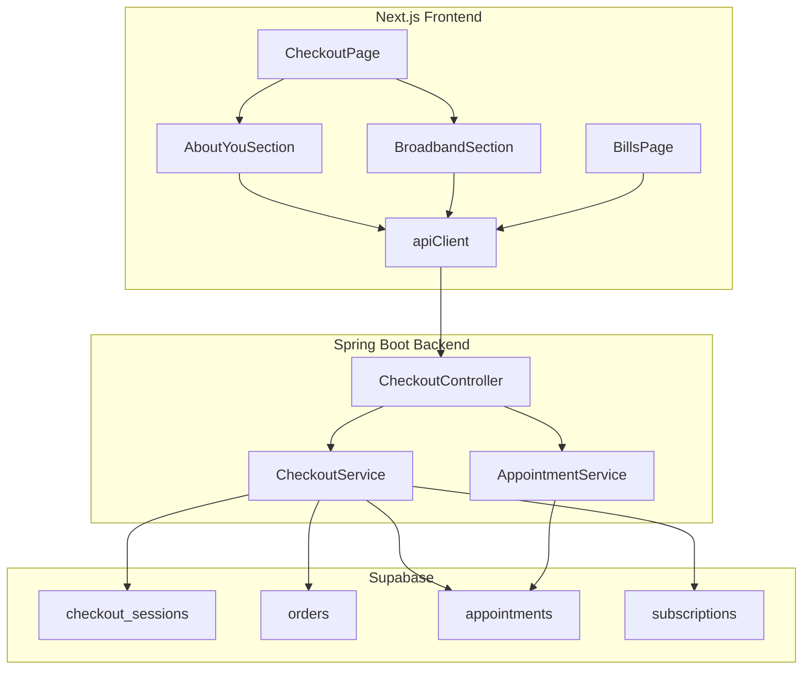

# Design Document: Checkout & Billing Enhancements

## Overview

This design covers three enhancements to the telecom shopping application's checkout and billing experience:

1. **Personal Details Persistence** — The existing "About You" form on the checkout page currently collects customer details client-side only. This enhancement persists those details to the backend via new API endpoints, pre-populates them on reload, and uses the saved address for appointment booking instead of the hardcoded "TBD" placeholder.

2. **Multiple Broadband Plan Booking** — The current checkout flow treats all broadband service items as a single unit with one `appointmentBooked` boolean flag. This enhancement tracks booking status per broadband item, creates separate service orders and appointments for each, and provides per-item scheduling controls in the UI.

3. **Detailed Bills Table** — The current bills page fetches a single subscription and renders it as a card. This enhancement fetches all subscriptions for a session and displays them in a table with columns for product name, due date, payment amount, breakdown, and status.

All changes span the Next.js frontend and the Spring Boot backend, communicating via REST over the existing `apiClient` / `CheckoutController` boundary.

## Architecture

The system follows the existing architecture: a Next.js frontend calling a Spring Boot backend that persists data to Supabase via the `SupabaseClient` wrapper.



### Key Architectural Decisions

1. **Customer details stored on `checkout_sessions` table** — Rather than creating a separate `customer_details` table, we add columns (`customer_name`, `customer_email`, `customer_phone`, `customer_address`) directly to the existing `checkout_sessions` row. This keeps the data co-located with the session and avoids an extra join. The session already exists before payment, so the columns are simply nullable until the customer submits the form.

2. **Per-item appointment tracking via a map** — The current `appointmentBooked` boolean on `checkout_sessions` is replaced with a JSON map or per-item query approach. Each broadband `cart_item` ID maps to its appointment status. The `CheckoutSession` model gains a `Map<String, String>` field (`broadbandBookingStatus`) keyed by cart item ID, with values like `"unbooked"` or the appointment ID.

3. **Multiple subscriptions endpoint** — The existing `GET /api/checkout/subscriptions/{sessionId}` returns a single `Subscription`. A new endpoint returns `List<Subscription>` for the bills table. The old endpoint is kept for backward compatibility but the bills page switches to the list endpoint.

## Components and Interfaces

### New/Modified Backend Endpoints

| Method | Path | Description |
|--------|------|-------------|
| `PUT` | `/api/checkout/session/{sessionId}/customer-details` | Save customer details to checkout session |
| `GET` | `/api/checkout/session/{sessionId}/customer-details` | Retrieve saved customer details |
| `POST` | `/api/checkout/appointments` | Book appointment — now accepts optional `broadbandItemId` field |
| `GET` | `/api/checkout/subscriptions/{sessionId}/all` | Return all subscriptions for a session |

### Modified Frontend Components

| Component | Changes |
|-----------|---------|
| `CheckoutPage` (`src/app/checkout/page.tsx`) | Calls save/load customer details endpoints; passes `aboutYou` state to/from backend on submit and on load |
| `BroadbandSection` (`src/components/checkout/BroadbandSection.tsx`) | Renders per-item booking UI; tracks which items are booked; calls appointment endpoint with `broadbandItemId` |
| `BillsPage` (`src/app/bills/page.tsx`) | Calls list subscriptions endpoint; renders `BillsTable` component |
| `apiClient` (`src/lib/api-client.ts`) | New methods: `saveCustomerDetails`, `getCustomerDetails`, `getSubscriptions` (list); modified `bookAppointment` to accept optional `broadbandItemId` |

### New Frontend Components

| Component | Purpose |
|-----------|---------|
| `BillsTable` (inline in `BillsPage` or extracted) | Table rendering subscriptions with product name, due date, amount, breakdown, status badge |

### New/Modified Backend Classes

| Class | Changes |
|-------|---------|
| `CheckoutService` | New methods: `saveCustomerDetails`, `getCustomerDetails`; modified `bookAppointment` to accept item ID, create per-item orders; new `getSubscriptionsBySession` returning list |
| `CheckoutController` | New endpoints for customer details CRUD and list subscriptions |
| `CheckoutSession` (model) | New field `customerDetails` (`CustomerDetails` object); replace `appointmentBooked` boolean with `broadbandBookingStatus` map |
| `CustomerDetails` (new model) | POJO: `fullName`, `email`, `phone`, `address` |
| `AppointmentRequest` (model) | New optional field `broadbandItemId` |
| `Subscription` (model) | New field `planName` for display in bills table |

### Frontend Type Changes

| Type | Changes |
|------|---------|
| `CheckoutSession` | Add `customerDetails?: CustomerDetails`; replace `appointmentBooked: boolean` with `broadbandBookingStatus: Record<string, string>` |
| `CustomerDetails` (new) | `fullName: string; email: string; phone: string; address: string` |
| `AppointmentRequest` | Add optional `broadbandItemId?: string` |
| `Subscription` | Add `planName?: string` |

## Data Models

### CustomerDetails (new model)

```java
@Data
@NoArgsConstructor
@AllArgsConstructor
public class CustomerDetails {
    private String fullName;   // required
    private String email;      // required
    private String phone;      // optional
    private String address;    // required
}
```

### CheckoutSession (modified)

```typescript
// Frontend type
export interface CustomerDetails {
  fullName: string;
  email: string;
  phone: string;
  address: string;
}

export interface CheckoutSession {
  sessionId: string;
  hasDevices: boolean;
  hasBroadbandService: boolean;
  devicePaymentDone: boolean;
  // CHANGED: was `appointmentBooked: boolean`
  broadbandBookingStatus: Record<string, string>; // cartItemId -> "unbooked" | appointmentId
  oneTimeTotal: number;
  monthlyTotal: number;
  status: 'open' | 'device_paid' | 'complete';
  deviceItems: CheckoutCartItem[];
  serviceItems: CheckoutCartItem[];
  customerDetails?: CustomerDetails;
}
```

### AppointmentRequest (modified)

```typescript
export interface AppointmentRequest {
  sessionId: string;
  preferredDate: string;
  preferredTimeSlot: string;
  broadbandItemId?: string; // NEW: identifies which broadband plan this appointment is for
}
```

### Subscription (modified)

```typescript
export interface Subscription {
  subscriptionId: string;
  orderId: string;
  status: 'inactive' | 'active' | 'cancelled';
  monthlyPrice: number;
  startDate?: string;
  activatedAt?: string;
  planName?: string; // NEW: for bills table display
}
```

### Database Schema Changes (checkout_sessions table)

| Column | Type | Description |
|--------|------|-------------|
| `customer_name` | `text` | Customer full name (nullable) |
| `customer_email` | `text` | Customer email (nullable) |
| `customer_phone` | `text` | Customer phone (nullable) |
| `customer_address` | `text` | Customer address (nullable) |

The `appointment_booked` boolean column on `checkout_sessions` is replaced by querying appointments per broadband cart item. The `CheckoutService.buildCheckoutSession` method computes `broadbandBookingStatus` by joining `cart_items` (broadband type) with `appointments` (by `cart_item_id`).

### Database Schema Changes (appointments table)

| Column | Type | Description |
|--------|------|-------------|
| `cart_item_id` | `text` | References the specific broadband cart item this appointment is for (nullable for backward compat) |

### Database Schema Changes (subscriptions table)

| Column | Type | Description |
|--------|------|-------------|
| `plan_name` | `text` | Display name of the broadband plan (nullable, defaults to "Broadband Plan") |


## Correctness Properties

*A property is a characteristic or behavior that should hold true across all valid executions of a system — essentially, a formal statement about what the system should do. Properties serve as the bridge between human-readable specifications and machine-verifiable correctness guarantees.*

### Property 1: Customer details validation controls step transition

*For any* combination of values for the fields (fullName, email, phone, address), the About You form submission should succeed and transition to the payment step if and only if fullName is non-blank, email is non-blank, and address is non-blank. If any required field is blank, the form should remain on the About You step and display a validation error.

**Validates: Requirements 1.3, 1.4**

### Property 2: Customer details round-trip persistence

*For any* valid `CustomerDetails` object (non-blank fullName, email, address; arbitrary phone), saving it to a checkout session and then retrieving it should return an object with identical field values.

**Validates: Requirements 1.6, 4.1, 4.2**

### Property 3: Per-item broadband booking isolation

*For any* checkout session containing N broadband service items (N ≥ 1), booking an appointment for one specific item should mark only that item as booked. The remaining N-1 items should remain unbooked, and their booking status should be unchanged.

**Validates: Requirements 2.1, 2.2, 2.3**

### Property 4: All-booked completion summary

*For any* checkout session containing N broadband service items where all N items have booked appointments, the broadband booking status map should contain N entries each with a non-"unbooked" value, and the session status should reflect completion.

**Validates: Requirements 2.4, 5.4**

### Property 5: One service order and appointment per broadband item

*For any* checkout session with N broadband service items, after booking appointments for all N items, there should be exactly N service order records and N appointment records in the database, each linked to a distinct broadband cart item.

**Validates: Requirements 2.5, 5.1, 5.2, 5.3**

### Property 6: Cancellation removes only the target item

*For any* checkout session with N broadband items (N ≥ 2) where at least one is booked, cancelling one specific item should remove that item and its associated appointment while leaving all other items and their appointments unchanged.

**Validates: Requirements 2.6**

### Property 7: Subscription count matches table rows

*For any* list of subscriptions returned by the backend for a session, the bills table should render exactly that many rows.

**Validates: Requirements 3.2, 5.5**

### Property 8: GBP currency formatting

*For any* non-negative number representing a monthly price, the formatted currency string should match the pattern `£X.XX` where X.XX is the number formatted to exactly two decimal places.

**Validates: Requirements 3.3**

### Property 9: Due date computation

*For any* subscription, if its status is "active" and it has an activation date, the displayed due date should be exactly one calendar month from the activation date. If its status is "inactive", the displayed due date should be the string "After installation".

**Validates: Requirements 3.5, 3.6**

### Property 10: Status badge mapping

*For any* subscription status value in {"active", "inactive", "cancelled"}, the status badge should display the corresponding label: "Active", "Pending Installation", or "Cancelled" respectively.

**Validates: Requirements 3.4**

### Property 11: Bills breakdown contains plan name and price

*For any* subscription with a plan name and monthly price, the breakdown column should contain both the plan name string and the formatted monthly price.

**Validates: Requirements 3.7**

### Property 12: Device payment associates customer details

*For any* checkout session that has saved customer details, after processing a device payment, the created order record should contain the customer's address as the shipping address.

**Validates: Requirements 4.3**

### Property 13: Appointment uses saved address

*For any* checkout session that has saved customer details with a non-blank address, when a broadband appointment is booked, the appointment's installation address should equal the saved customer address (not "TBD").

**Validates: Requirements 4.4**

## Error Handling

### Frontend Error Handling

| Scenario | Handling |
|----------|----------|
| Customer details save fails (network error) | Display inline error message on the About You form; do not transition to payment step |
| Customer details load fails on page reload | Proceed with empty form fields; log warning to console |
| Appointment booking fails for one broadband item | Display error on that specific item's booking card; other items remain unaffected |
| Subscriptions list fetch fails on bills page | Display error banner with retry option; do not render empty state |
| Session not found on checkout load | Redirect to cart page (existing behavior) |

### Backend Error Handling

| Scenario | HTTP Status | Response |
|----------|-------------|----------|
| Save customer details for non-existent session | 404 | `{ "message": "Checkout session not found" }` |
| Book appointment with invalid broadband item ID | 404 | `{ "message": "Broadband item not found in checkout session" }` |
| Book appointment for already-booked item | 409 | `{ "message": "Appointment already booked for this item" }` |
| Retrieve customer details for session with none saved | 200 | Return empty/null `CustomerDetails` object (not an error) |
| Retrieve subscriptions for session with none | 200 | Return empty list `[]` |

### Validation Rules

- `fullName`: required, non-blank after trimming
- `email`: required, non-blank after trimming (basic format check on frontend)
- `phone`: optional, no validation
- `address`: required, non-blank after trimming
- `broadbandItemId`: required for appointment booking when session has multiple broadband items; must reference an existing cart item of type `broadband_service`

## Testing Strategy

### Property-Based Testing

Property-based tests use **fast-check** (TypeScript) for frontend logic and **jqwik** (Java) for backend service logic. Each property test runs a minimum of 100 iterations with randomly generated inputs.

Each test is tagged with a comment referencing the design property:
```
// Feature: checkout-billing-enhancements, Property N: <property text>
```

**Frontend property tests (fast-check):**

| Property | Test Description |
|----------|-----------------|
| Property 1 | Generate random strings for fullName, email, address (including empty/whitespace-only). Assert form transitions iff all required fields are non-blank. |
| Property 8 | Generate random non-negative floats. Assert `formatCurrency(n)` matches `£X.XX` pattern. |
| Property 9 | Generate random dates and statuses. Assert due date computation matches spec. |
| Property 10 | Generate random status values from the enum. Assert badge label mapping. |
| Property 11 | Generate random plan names and prices. Assert breakdown string contains both. |

**Backend property tests (jqwik):**

| Property | Test Description |
|----------|-----------------|
| Property 2 | Generate random CustomerDetails. Save then retrieve. Assert equality. |
| Property 3 | Generate random N broadband items. Book one. Assert only that one is marked booked. |
| Property 5 | Generate random N broadband items. Book all. Assert N orders and N appointments exist. |
| Property 6 | Generate N items, book some, cancel one. Assert only the cancelled item is removed. |
| Property 7 | Generate random subscription lists. Assert list endpoint returns correct count. |
| Property 12 | Generate random customer details. Process payment. Assert order has correct address. |
| Property 13 | Generate random customer details with address. Book appointment. Assert appointment address matches. |

### Unit Testing

Unit tests complement property tests by covering specific examples, edge cases, and integration points:

**Frontend unit tests (Jest/React Testing Library):**
- Checkout page renders About You step first on initial load (Req 1.1)
- About You form contains all required fields (Req 1.2)
- Payment step shows customer details summary with Edit link (Req 1.5)
- Pre-population of form fields when session has saved details (Req 1.7)
- Bills page renders table with correct column headers (Req 3.1)
- Bills page shows empty state when no subscriptions (Req 3.8)
- All-booked state shows combined confirmation summary (Req 2.4)

**Backend unit tests (JUnit 5):**
- Save customer details to non-existent session returns 404 (Req 4.5)
- Book appointment with non-existent broadband item returns 404 (Req 5.6)
- Book appointment for already-booked item returns 409
- Retrieve subscriptions for session with no subscriptions returns empty list
- Build checkout session correctly computes broadbandBookingStatus map
