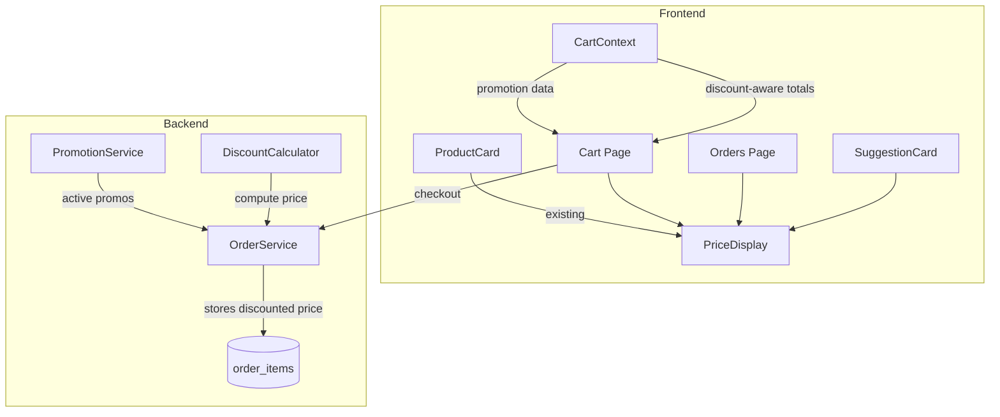

# Design Document: Consistent Discounted Pricing

## Overview

This feature extends the existing discounted price display pattern (currently only in `ProductCard`) to all pricing surfaces in the application: Cart page, Orders page, and AI Suggestion cards. It also updates `CartContext` to compute discount-aware totals and modifies the backend `OrderService` to persist discounted pricing data in order records.

The core principle is consistency: wherever a product price appears, if that product has an active automatic promotion, the user sees the discounted price highlighted alongside the struck-through original price, using the same visual treatment already established in `ProductCard`.

## Architecture

The feature touches three layers:

1. **Shared UI Component** — A new `PriceDisplay` component encapsulates the discount visual pattern (highlight color for discounted price, strikethrough for original, optional promotional label badge). All pricing surfaces delegate to this component.

2. **Frontend State (CartContext)** — The existing `CartContext` already fetches promotions per cart item and exposes `CartItemPromotion` data. The cart page and order summary need to consume this data for rendering and subtotal computation.

3. **Backend Persistence (OrderService + Schema)** — The `order_items` table gains `original_price` and `promotional_label` columns. `OrderService.createOrder` applies active automatic promotions at order time, storing both the discounted price and original price so the Orders page can display historical discount information.



## Components and Interfaces

### PriceDisplay Component

A shared React component extracted to `src/components/ui/PriceDisplay.tsx`.

```typescript
interface PriceDisplayProps {
  originalPrice: number;
  discountedPrice?: number | null;
  promotionalLabel?: string | null;
}
```

Rendering logic:
- If `discountedPrice` is provided and differs from `originalPrice`: show discounted price in `#ef4444` (bold), original price with `line-through` in `#9ca3af`, and optional label badge.
- Otherwise: show only `originalPrice` in the default style.

This matches the existing pattern in `ProductCard` lines where `discountedPrice !== null` triggers the dual-price display.

### CartContext (existing, already updated)

The `CartContext` already:
- Fetches promotions per cart item via `apiClient.getPromotionsForProduct`
- Filters for active automatic promotions (`active === true && promoCode === null`)
- Computes `discountedPrice` using `calculateDiscountedPrice`
- Exposes `CartItemPromotion` per item with `discountedPrice`, `promotionalLabel`, `originalPrice`
- Computes `total` using discounted prices where applicable
- Applies coupon discount after automatic promotion discount

No structural changes needed to `CartContext` — the cart page and other consumers just need to read the existing promotion data.

### SuggestionCard Enhancement

`SuggestionCard` will fetch promotions for its product (same pattern as `ProductCard`) and use `PriceDisplay` to render the price. It gains local state for promotions:

```typescript
const [promotions, setPromotions] = useState<Promotion[]>([]);
// useEffect fetches via apiClient.getPromotionsForProduct(product.id)
const activePromo = promotions.find(p => p.active && !p.promoCode);
const discountedPrice = activePromo
  ? calculateDiscountedPrice(product.price, activePromo.discountType, activePromo.discountValue)
  : null;
```

### Orders Page Enhancement

The `OrderItem` TypeScript interface gains two fields:

```typescript
interface OrderItem {
  productId: string;
  productName: string;
  price: number;           // the price paid (discounted if promotion applied)
  originalPrice?: number;  // the original price before discount
  promotionalLabel?: string | null;
  quantity: number;
  imageUrl: string;
}
```

Display logic: if `price !== originalPrice`, render via `PriceDisplay` with both prices; otherwise render only the price.

### Backend: Order.OrderItem Model

Add two fields to the `OrderItem` inner class:

```java
public static class OrderItem {
    private String productId;
    private String productName;
    private double price;           // discounted price (or original if no promo)
    private double originalPrice;   // always the original price
    private String promotionalLabel; // null if no promo
    private int quantity;
    private String imageUrl;
}
```

### Backend: OrderService.createOrder

For each cart item:
1. Fetch active promotions via `PromotionService`
2. Filter for active automatic promotions (`active && promoCode == null`)
3. If found: compute discounted price, set `price = discountedPrice`, `originalPrice = product.price`, `promotionalLabel = promo.label`
4. If not found: set `price = product.price`, `originalPrice = product.price`, `promotionalLabel = null`
5. Persist `original_price` and `promotional_label` in the `order_items` insert
6. Compute `totalAmount` using the effective (possibly discounted) prices

## Data Models

### order_items Table (updated schema)

```sql
CREATE TABLE order_items (
    id UUID PRIMARY KEY DEFAULT gen_random_uuid(),
    order_id UUID NOT NULL REFERENCES orders(id) ON DELETE CASCADE,
    product_id TEXT NOT NULL,
    product_name TEXT NOT NULL,
    price NUMERIC(10, 2) NOT NULL,          -- effective price (discounted or original)
    original_price NUMERIC(10, 2),          -- NEW: always the original price
    promotional_label TEXT,                  -- NEW: label from the promotion, nullable
    quantity INTEGER NOT NULL,
    image_url TEXT,
    created_at TIMESTAMPTZ DEFAULT now()
);
```

### CartItemPromotion (existing TypeScript interface)

```typescript
export interface CartItemPromotion {
    discountedPrice: number;
    promotionalLabel: string | null;
    originalPrice: number;
}
```

### Promotion Filtering Logic

An "active automatic promotion" is identified by:
- `active === true`
- `promoCode === null` (not a coupon-based promotion)

This filter is applied consistently in `CartContext`, `ProductCard`, `SuggestionCard`, and `OrderService`.


## Correctness Properties

*A property is a characteristic or behavior that should hold true across all valid executions of a system — essentially, a formal statement about what the system should do. Properties serve as the bridge between human-readable specifications and machine-verifiable correctness guarantees.*

### Property 1: PriceDisplay rendering correctness

*For any* `PriceDisplayProps` with an `originalPrice > 0`, a `discountedPrice` (either null or a positive number less than `originalPrice`), and an optional `promotionalLabel`:
- If `discountedPrice` is provided and differs from `originalPrice`, the rendered output must contain both the discounted price and the original price.
- If `discountedPrice` is null or equals `originalPrice`, the rendered output must contain only the original price and must not contain strikethrough styling or a promotional label.
- If `promotionalLabel` is provided and `discountedPrice` is present, the rendered output must contain the label text.

**Validates: Requirements 1.1, 1.2, 1.3, 1.4, 2.1, 2.2, 2.3, 2.4, 3.1, 3.2, 3.3, 3.4**

### Property 2: Cart total with automatic promotions equals sum of effective prices

*For any* list of cart items where each item has a positive `originalPrice`, a `quantity >= 1`, and optionally a `discountedPrice` (from an active automatic promotion), the cart total must equal the sum of `effectivePrice * quantity` for each item, where `effectivePrice` is `discountedPrice` if a promotion exists, or `originalPrice` otherwise.

**Validates: Requirements 1.5, 4.1**

### Property 3: Coupon discount is applied after automatic promotion discount

*For any* cart item with a positive `originalPrice`, an active automatic promotion yielding a `discountedPrice`, and a coupon with a `discountType` and `discountValue`, the final price after both discounts must equal `calculateDiscountedPrice(discountedPrice, couponDiscountType, couponDiscountValue)` — that is, the coupon is applied to the already-discounted price, not the original price.

**Validates: Requirements 4.2**

### Property 4: Order item price and metadata storage

*For any* product with a positive `originalPrice` and an optional active automatic promotion:
- If a promotion exists: the stored `price` must equal `calculateDiscountedPrice(originalPrice, discountType, discountValue)`, the stored `original_price` must equal `originalPrice`, and the stored `promotional_label` must equal the promotion's label.
- If no promotion exists: the stored `price` must equal `originalPrice`, the stored `original_price` must equal `originalPrice`, and the stored `promotional_label` must be null.

**Validates: Requirements 6.1, 6.2, 6.3, 6.4**

## Error Handling

| Scenario | Handling |
|---|---|
| Promotion fetch fails for a cart item | Skip promotion for that item; display original price only. CartContext already catches and ignores per-item fetch errors. |
| Promotion fetch fails for SuggestionCard | Display original price only. Same try/catch pattern as ProductCard. |
| Discount calculation produces negative price | `calculateDiscountedPrice` already floors at 0 via `Math.max(0, result)`. |
| Backend promotion fetch fails during order creation | Store original price as both `price` and `original_price`; set `promotional_label` to null. Order still succeeds. |
| `original_price` column is null for legacy orders | Orders page treats null `originalPrice` as equal to `price`, showing no discount styling. |
| Coupon applied to already-discounted item yields 0 | Valid — item is free. `Math.max(0, ...)` prevents negative totals. |

## Testing Strategy

### Unit Tests

Unit tests cover specific examples, edge cases, and integration points:

- **PriceDisplay component**: Render with discount, without discount, with label, without label. Verify correct DOM structure and styles.
- **Cart page**: Render cart items with and without promotions. Verify subtotal reflects discounted prices.
- **Orders page**: Render order items with `originalPrice` different from `price` and verify dual-price display. Render items where `originalPrice === price` and verify single-price display.
- **SuggestionCard**: Render with and without active promotions. Verify price display delegates to PriceDisplay pattern.
- **Backend OrderService**: Test `createOrder` with mocked PromotionService returning active promotions. Verify stored `price`, `original_price`, and `promotional_label` values.

### Property-Based Tests

Property tests use **fast-check** with **vitest** (both already configured in the project). Each property test runs a minimum of 100 iterations.

Each property test must be tagged with a comment referencing the design property:

```typescript
// Feature: consistent-discounted-pricing, Property 1: PriceDisplay rendering correctness
// Feature: consistent-discounted-pricing, Property 2: Cart total with automatic promotions equals sum of effective prices
// Feature: consistent-discounted-pricing, Property 3: Coupon discount is applied after automatic promotion discount
// Feature: consistent-discounted-pricing, Property 4: Order item price and metadata storage
```

**Property test file**: `src/lib/__tests__/discountedPricingProperties.test.ts`

**Generators needed**:
- `arbitraryPrice`: positive number (e.g., `fc.float({ min: 0.01, max: 9999.99 })`)
- `arbitraryDiscount`: `{ discountType: 'percentage' | 'fixed_amount', discountValue: number }` with sensible ranges
- `arbitraryCartItem`: product with price, quantity, and optional promotion
- `arbitraryPromotion`: active/inactive, with/without promoCode, with/without label

Each correctness property (1–4) maps to exactly one property-based test. Unit tests complement these by covering specific edge cases like zero-quantity items, legacy orders without `original_price`, and coupon-only discounts.
