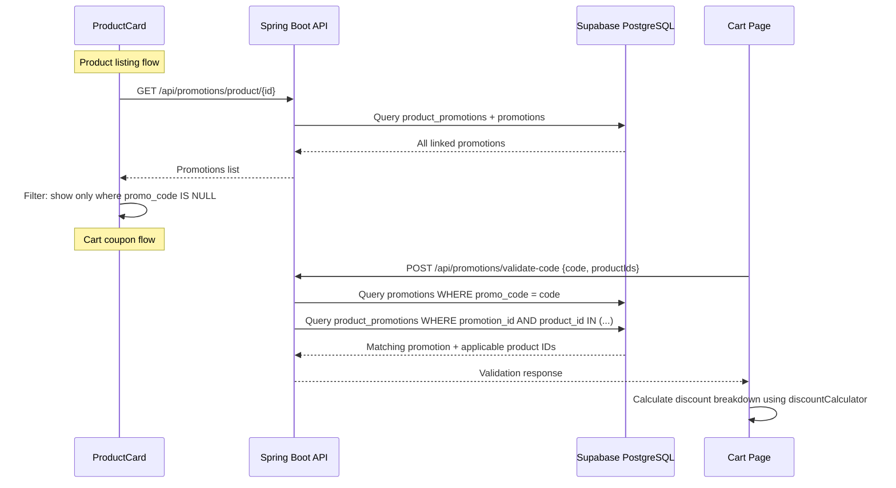

# Design Document: Selective Promotions & Coupon Codes

## Overview

This feature modifies the existing promotions system to support two distinct promotion types: direct promotions (visible on product cards) and coupon-code promotions (applied at cart via code entry). The changes span the seed script, backend validation endpoint, frontend product card filtering, and a new coupon input + discount breakdown on the cart page.

The key design principle is that the existing `promotions` table schema already supports this distinction via the `promo_code` and `promotional_label` columns — no schema migration is needed. The differentiation is purely data-driven and enforced at the application layer.

## Architecture



## Components and Interfaces

### Backend Changes

#### 1. PromotionService — New Method: `validateCouponCode`

```java
/**
 * Validates a coupon code and returns the promotion with applicable product IDs.
 *
 * @param code       the coupon code string
 * @param productIds list of product IDs to check eligibility against
 * @return CouponValidationResult containing promotion details and applicable product IDs
 * @throws InvalidCouponException if code not found, expired, or inactive
 */
public CouponValidationResult validateCouponCode(String code, List<String> productIds)
```

#### 2. PromotionController — New Endpoint

```java
@PostMapping("/validate-code")
public ResponseEntity<?> validateCouponCode(@RequestBody CouponValidationRequest request)
```

Request body:
```json
{
  "code": "SUMMER15",
  "productIds": ["uuid-1", "uuid-2", "uuid-3"]
}
```

Success response (200):
```json
{
  "promotionId": "uuid",
  "promotionName": "Summer Sale 15% Off",
  "discountType": "percentage",
  "discountValue": 15,
  "applicableProductIds": ["uuid-1", "uuid-3"]
}
```

Error responses:
- 404: `{ "error": "Invalid coupon code" }`
- 400: `{ "error": "Coupon code has expired" }` or `{ "error": "Coupon code is not currently active" }`

#### 3. New Model Classes

```java
// Request DTO
public class CouponValidationRequest {
    private String code;
    private List<String> productIds;
}

// Response DTO
public class CouponValidationResult {
    private String promotionId;
    private String promotionName;
    private String discountType;
    private double discountValue;
    private List<String> applicableProductIds;
}
```

### Frontend Changes

#### 1. ProductCard.tsx — Promotion Filtering

The existing `ProductCard` fetches all promotions for a product. The change filters to only show promotions where `promoCode` is null:

```typescript
const activePromo = promotions.find(p => p.active && !p.promoCode);
```

This is a single-line change in the existing component.

#### 2. apiClient — New Method

```typescript
async validateCouponCode(code: string, productIds: string[]): Promise<CouponValidationResult> {
  const res = await fetch(`${API_URL}/api/promotions/validate-code`, {
    method: 'POST',
    headers: { 'Content-Type': 'application/json' },
    body: JSON.stringify({ code, productIds })
  });
  if (!res.ok) {
    const data = await res.json();
    throw new Error(data.error || 'Failed to validate coupon code');
  }
  return res.json();
}
```

#### 3. Cart Page — Coupon Input & Discount Breakdown

The cart page gains two new UI sections within the existing Order Summary card:

- **Coupon Input**: A text field + Apply button placed above the subtotal line. Shows success/error states and a Remove button when a coupon is active.
- **Discount Breakdown**: When a coupon is applied, the summary shows subtotal, discount line (promotion name + amount), and adjusted total.

State management is local to the cart page component (no context changes needed):

```typescript
const [couponCode, setCouponCode] = useState('');
const [appliedCoupon, setAppliedCoupon] = useState<CouponValidationResult | null>(null);
const [couponError, setCouponError] = useState('');
const [isValidating, setIsValidating] = useState(false);
```

### Seed Script Changes

The seed script is restructured so that:
- ~2 promotions are Direct_Promotions (no promo_code, has promotional_label) linked to ~20 products
- ~3 promotions are Coupon_Promotions (has promo_code, no promotional_label) linked to broader product sets
- The "Welcome" promo that currently links to all 100 products becomes coupon-code-only

## Data Models

### Existing Schema (No Changes)

The `promotions` table already has the necessary columns:

| Column | Type | Direct_Promotion | Coupon_Promotion |
|--------|------|-------------------|-------------------|
| promo_code | TEXT | NULL | Non-null (e.g., "SUMMER15") |
| promotional_label | TEXT | Non-null (e.g., "Flash Deal") | NULL |
| is_active | BOOLEAN | true | true |
| start_date | TIMESTAMPTZ | Set | Set |
| end_date | TIMESTAMPTZ | Set | Set |

### New TypeScript Interface

```typescript
interface CouponValidationResult {
  promotionId: string;
  promotionName: string;
  discountType: 'percentage' | 'fixed_amount';
  discountValue: number;
  applicableProductIds: string[];
}
```

### Seed Data Plan

| Promotion | Type | promo_code | promotional_label | Linked Products |
|-----------|------|------------|-------------------|-----------------|
| Flash Deal 10% Off Samsung | Direct | null | "Flash Deal" | ~10 Samsung phones |
| Apple Trade-In Bonus £50 | Direct | null | "Trade-In Bonus" | ~10 Apple phones |
| Summer Sale 15% Off | Coupon | "SUMMER15" | null | Mid-range phones (<£700) |
| New Customer £20 Off | Coupon | "WELCOME20" | null | All products |
| Pixel Launch 5% Off | Coupon | "PIXEL5" | null | Pixel 9 series |

This gives ~20 products with visible promotions (Samsung + Apple direct promos) and 3 coupon-code-only promotions.


## Correctness Properties

*A property is a characteristic or behavior that should hold true across all valid executions of a system — essentially, a formal statement about what the system should do. Properties serve as the bridge between human-readable specifications and machine-verifiable correctness guarantees.*

### Property 1: Promotion filtering excludes coupon-only promotions

*For any* product and *for any* set of promotions linked to that product, the Product_Card filtering logic shall return only promotions where `promoCode` is null. No promotion with a non-null `promoCode` shall ever appear in the filtered result.

**Validates: Requirements 2.1**

### Property 2: Direct promotion displays correct discounted price

*For any* product with a Direct_Promotion (promoCode is null, promotionalLabel is non-null), the displayed price shall equal the result of `calculateDiscountedPrice(product.price, promotion.discountType, promotion.discountValue)`. The promotional label displayed shall match the promotion's `promotionalLabel` field.

**Validates: Requirements 2.3**

### Property 3: Valid coupon returns correct applicable products

*For any* active, non-expired promotion with a promo_code, and *for any* set of submitted product IDs, the Validation_Endpoint shall return `applicableProductIds` equal to the intersection of the submitted product IDs and the product IDs linked to that promotion in the `product_promotions` table.

**Validates: Requirements 3.1**

### Property 4: Invalid/expired/inactive coupons return appropriate errors

*For any* coupon code submission: if the code does not exist in the database, the endpoint returns 404; if the promotion's `end_date` is in the past, the endpoint returns 400 with an expiry message; if the promotion's `is_active` is false, the endpoint returns 400 with an inactive message. The error type is determined by the first matching condition in this priority order.

**Validates: Requirements 3.2, 3.3, 3.4**

### Property 5: Whitespace-only coupon codes are rejected client-side

*For any* string composed entirely of whitespace characters (including empty string), the Coupon_Input shall reject the submission without making a network request and shall display an error message.

**Validates: Requirements 4.3**

### Property 6: Cart discount calculation consistency

*For any* cart containing items and *for any* applied coupon with a set of applicable product IDs, the following invariant holds: `total = subtotal - discountAmount`, where `subtotal = Σ(item.price × item.quantity)` for all items, and `discountAmount = Σ((item.price - calculateDiscountedPrice(item.price, discountType, discountValue)) × item.quantity)` for all items whose product ID is in the applicable set.

**Validates: Requirements 5.1, 5.2, 5.3**

### Property 7: API client propagates error messages

*For any* non-OK HTTP response from the Validation_Endpoint containing an `error` field in the JSON body, the `validateCouponCode` method shall throw an Error whose message contains the value of that `error` field.

**Validates: Requirements 6.3**

## Error Handling

| Scenario | Layer | Behavior |
|----------|-------|----------|
| Invalid coupon code (not found) | Backend | Return 404 with `{ "error": "Invalid coupon code" }` |
| Expired coupon code | Backend | Return 400 with `{ "error": "Coupon code has expired" }` |
| Inactive coupon code | Backend | Return 400 with `{ "error": "Coupon code is not currently active" }` |
| Empty/whitespace coupon input | Frontend | Show inline error, no network request |
| Network failure during validation | Frontend | Show generic error message "Failed to validate coupon code" |
| Supabase connection failure | Backend | Return 503 with "Service temporarily unavailable" (existing pattern) |
| Valid code, no eligible cart items | Backend + Frontend | Return 200 with empty `applicableProductIds`; frontend shows £0.00 discount with "No items eligible" message |

## Testing Strategy

### Property-Based Tests (Java — jqwik)

The backend already uses jqwik for property-based testing. Each correctness property maps to a jqwik test:

- **Property 3** (valid coupon applicable products): Generate random promotions with random product links, submit random subsets of product IDs, verify the response's `applicableProductIds` equals the intersection.
- **Property 4** (error conditions): Generate promotions with various invalid states (non-existent codes, expired dates, inactive flags), verify correct HTTP status and error messages.
- **Property 6** (cart discount calculation): Generate random cart items and random coupon parameters, verify the arithmetic invariant `total = subtotal - discount`.

Each test runs minimum 100 iterations. Tag format: `Feature: selective-promotions-coupon-codes, Property N: <title>`.

### Property-Based Tests (TypeScript — fast-check)

For frontend logic:

- **Property 1** (promotion filtering): Generate random arrays of Promotion objects with mixed promoCode values, verify filter returns only null-promoCode entries.
- **Property 2** (discounted price display): Generate random products and direct promotions, verify calculated price matches discountCalculator output.
- **Property 5** (whitespace rejection): Generate random whitespace strings, verify rejection.
- **Property 7** (API error propagation): Generate random error response bodies, verify thrown error contains the message.

### Unit Tests

- Seed script output verification: run seed, query DB, assert ~20 products have direct promos
- Cart page rendering: coupon input present, apply button present, remove button appears after apply
- Success/error state transitions in coupon input component
- Edge cases: no eligible products message, coupon removal resets summary

### Integration Tests

- End-to-end coupon flow: apply valid code → verify discount in summary → remove code → verify summary resets
- ProductCard with mixed promotions: verify only direct promos render
