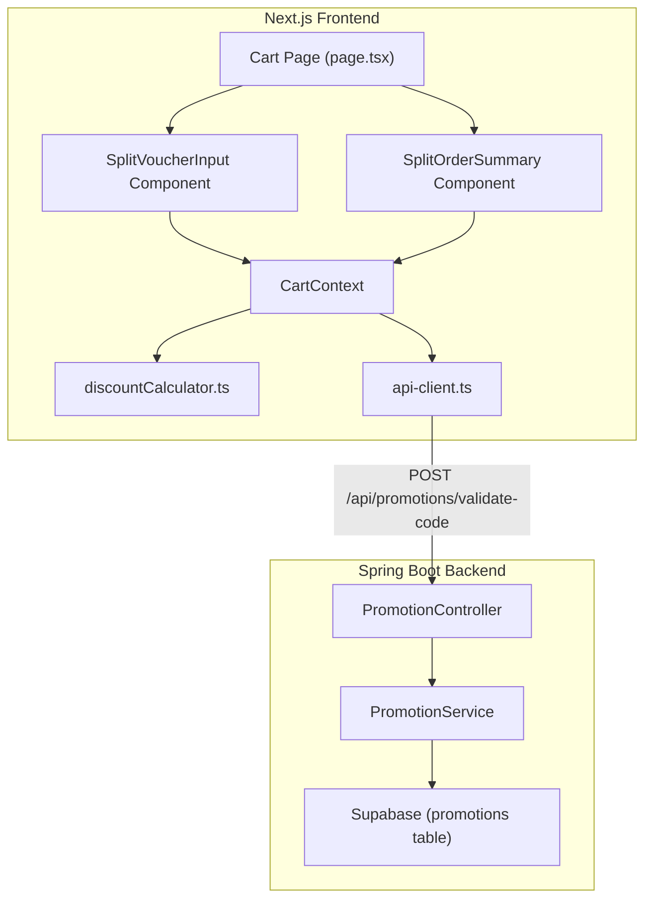

# Design Document: Split Voucher System

## Overview

The split voucher system replaces the cart's single coupon input with two independent voucher inputs — one for device items (one-time purchases) and one for broadband items (monthly subscriptions). The backend Promotion model is extended with `valid_till` (months of discount duration) and `applicable_item_type` (device, broadband, or both) columns. The validation endpoint gains an `itemType` parameter so it filters promotions by applicability. On the frontend, `CartContext` tracks two separate voucher states (`appliedDeviceVoucher` and `appliedBroadbandVoucher`), and the cart page renders a split order summary with "Pay Today" (devices) and "Pay Monthly" (broadband) sections. The existing `calculateDiscountedPrice` function is reused as-is; broadband-specific display logic (showing discounted price for N months, then full price) is handled in the UI layer.

## Architecture



The change is additive. The existing `/api/promotions/validate-code` endpoint is extended (not replaced) with an optional `itemType` field. When `itemType` is absent, the endpoint behaves exactly as before (backward compatible). When present, it filters by `applicable_item_type`.

## Components and Interfaces

### Backend Changes

**Promotion.java** — Add two fields:
- `validTill` (`Integer`, nullable) — number of months the discount applies. Null means unlimited.
- `applicableItemType` (`String`, nullable) — one of `"device"`, `"broadband"`, `"both"`, or null (treated as `"both"`).

**CouponValidationRequest.java** — Add optional field:
- `itemType` (`String`, nullable) — `"device"` or `"broadband"`. When provided, the service filters promotions by `applicable_item_type`.

**CouponValidationResult.java** — Add two fields:
- `validTill` (`Integer`, nullable) — passed through from the matched promotion so the frontend can display duration info.
- `applicableItemType` (`String`) — passed through so the frontend knows the voucher's scope.

**PromotionService.validateCouponCode** — Updated logic:
1. Query promotions by `promo_code` (unchanged).
2. If `itemType` is provided, check that the promotion's `applicable_item_type` matches `itemType` or is `"both"`. Reject with a descriptive error if mismatched.
3. Validate `applicable_item_type` value is one of the allowed enum values; reject if invalid.
4. Existing expiry and active checks remain unchanged.
5. Return `validTill` and `applicableItemType` in the result.

### Frontend Changes

**CartContext.tsx** — Replace single `appliedCoupon` state with:
- `appliedDeviceVoucher: CouponValidationResult | null`
- `appliedBroadbandVoucher: CouponValidationResult | null`
- `applyDeviceVoucher(code: string): Promise<void>` — calls validate with `itemType: "device"`
- `applyBroadbandVoucher(code: string): Promise<void>` — calls validate with `itemType: "broadband"`
- `removeDeviceVoucher(): void`
- `removeBroadbandVoucher(): void`
- Computed values: `payTodayTotal`, `payMonthlyTotal`, `deviceDiscount`, `broadbandDiscount`

**CouponValidationResult (products.ts)** — Add:
- `validTill: number | null`
- `applicableItemType: string`

**api-client.ts** — Update `validateCouponCode` to accept an optional `itemType` parameter and include it in the request body.

**SplitVoucherInput component** — New component rendered on the cart page. Conditionally shows device and/or broadband voucher input fields based on cart contents. Each field has its own apply/remove logic.

**SplitOrderSummary component** — New component replacing the current order summary. Shows "Pay Today" section for device items and "Pay Monthly" section for broadband items, each with their own subtotal, discount, and total lines. Broadband section shows duration note when a broadband voucher is applied (e.g., "£63.00/mo for first 3 months, then £70.00/mo").

**Cart page (page.tsx)** — Replaces the inline coupon input and order summary with the new `SplitVoucherInput` and `SplitOrderSummary` components.

### Database Changes

**Migration script** — Adds two columns to the `promotions` table:
```sql
ALTER TABLE promotions ADD COLUMN IF NOT EXISTS valid_till INTEGER DEFAULT NULL;
ALTER TABLE promotions ADD COLUMN IF NOT EXISTS applicable_item_type TEXT DEFAULT 'both';
```

**Seed script** — Inserts broadband, device, and "both" vouchers using `ON CONFLICT` for idempotency.

## Data Models

### Promotion (extended)

| Field                | Type      | Nullable | Default | Description                                      |
|----------------------|-----------|----------|---------|--------------------------------------------------|
| id                   | UUID      | No       | auto    | Primary key                                      |
| name                 | TEXT      | No       | —       | Display name                                     |
| description          | TEXT      | Yes      | —       | Description                                      |
| discount_type        | TEXT      | No       | —       | `percentage` or `fixed_amount`                   |
| discount_value       | NUMERIC   | No       | —       | Discount amount                                  |
| promo_code           | TEXT      | Yes      | —       | Unique coupon code                               |
| start_date           | TIMESTAMPTZ | Yes    | —       | Promotion start                                  |
| end_date             | TIMESTAMPTZ | Yes    | —       | Promotion end                                    |
| promotional_label    | TEXT      | Yes      | —       | UI label                                         |
| is_active            | BOOLEAN   | No       | true    | Active flag                                      |
| **valid_till**       | INTEGER   | Yes      | null    | Months of discounted pricing (broadband only)    |
| **applicable_item_type** | TEXT  | Yes      | `both`  | `device`, `broadband`, or `both`                 |
| created_at           | TIMESTAMPTZ | No     | now()   | Creation timestamp                               |

### CouponValidationRequest (extended)

```json
{
  "code": "BROADBAND10",
  "productIds": ["product-1", "broadband-fibre-100"],
  "itemType": "broadband"
}
```

### CouponValidationResult (extended)

```json
{
  "promotionId": "uuid",
  "promotionName": "10% Off Broadband",
  "discountType": "percentage",
  "discountValue": 10,
  "applicableProductIds": [],
  "validTill": 3,
  "applicableItemType": "broadband"
}
```

### CartContext State Shape

```typescript
// Two independent voucher slots
appliedDeviceVoucher: CouponValidationResult | null
appliedBroadbandVoucher: CouponValidationResult | null

// Computed totals
payTodayTotal: number      // sum of device items after device voucher discount
payMonthlyTotal: number    // sum of broadband items after broadband voucher discount
deviceDiscount: number     // total device discount amount
broadbandDiscount: number  // total broadband discount amount
```


## Correctness Properties

*A property is a characteristic or behavior that should hold true across all valid executions of a system — essentially, a formal statement about what the system should do. Properties serve as the bridge between human-readable specifications and machine-verifiable correctness guarantees.*

### Property 1: Promotion field round-trip

*For any* Promotion with a valid `valid_till` integer (or null) and a valid `applicable_item_type` value (`device`, `broadband`, or `both`), serializing the Promotion to JSON and deserializing it back should produce an equivalent Promotion with the same `valid_till` and `applicable_item_type` values.

**Validates: Requirements 1.1, 1.2, 1.3, 1.4**

### Property 2: Item type filtering

*For any* promotion with a known `applicable_item_type` and *for any* validation request with an `itemType` parameter, the validation should succeed if and only if the promotion's `applicable_item_type` equals the requested `itemType` or equals `"both"`. Otherwise, the validation should be rejected.

**Validates: Requirements 2.1, 2.2**

### Property 3: Voucher independence

*For any* cart state with both a device voucher and a broadband voucher applied, applying or removing one voucher should not change the other voucher's state. Specifically: applying a device voucher should leave the broadband voucher unchanged, removing a device voucher should leave the broadband voucher unchanged, and vice versa.

**Validates: Requirements 2.3, 2.4, 3.7, 3.8**

### Property 4: Discount calculation correctness

*For any* non-negative item price and *for any* valid discount (percentage between 0–100 or fixed amount ≥ 0), `calculateDiscountedPrice(price, discountType, discountValue)` should return `max(0, price * (1 - value/100))` for percentage discounts and `max(0, price - value)` for fixed discounts. This applies identically to both device and broadband items.

**Validates: Requirements 4.1, 4.2, 5.1, 5.2**

### Property 5: Pay Today total is sum of discounted device prices

*For any* list of device items with non-negative prices and *for any* optional device voucher, the Pay Today total should equal the sum of `calculateDiscountedPrice(item.price, voucher.discountType, voucher.discountValue) * item.quantity` across all device items (or the sum of undiscounted prices if no voucher is applied).

**Validates: Requirements 4.4**

### Property 6: Voucher input visibility matches cart contents

*For any* cart containing a mix of device and broadband items, the device voucher input field should be visible if and only if the cart contains at least one device item, and the broadband voucher input field should be visible if and only if the cart contains at least one broadband item.

**Validates: Requirements 3.1, 3.2, 3.3, 3.4**

### Property 7: Order summary section visibility matches cart contents

*For any* cart, the "Pay Today" section should be visible if and only if the cart contains at least one device item, and the "Pay Monthly" section should be visible if and only if the cart contains at least one broadband item.

**Validates: Requirements 6.1, 6.2, 6.5, 6.6, 6.7**

### Property 8: Order summary displays discount details when voucher applied

*For any* applied voucher (device or broadband), the order summary should display the original subtotal, the discount amount, and the discounted total. For broadband vouchers with a non-null `valid_till`, the summary should additionally display the promotional duration.

**Validates: Requirements 6.3, 6.4, 3.5, 3.6**

### Property 9: Broadband duration note formatting

*For any* broadband item with price P and *for any* broadband voucher with discount producing discounted price D and `valid_till` of N months, the formatted display string should contain the discounted price D, the duration N, and the original price P (e.g., "£D/mo for first N months, then £P/mo").

**Validates: Requirements 5.4**

### Property 10: Invalid applicable_item_type rejection

*For any* string that is not one of `"device"`, `"broadband"`, or `"both"`, when a promotion record contains that string as `applicable_item_type`, the Promotion Service should reject the promotion as invalid.

**Validates: Requirements 7.4**

### Property 11: Backward compatibility without itemType

*For any* validation request that omits the `itemType` field, the endpoint should behave identically to the original implementation: it should match promotions regardless of their `applicable_item_type` value, and the result should not include duration constraints.

**Validates: Requirements 9.1, 9.2**

### Property 12: Voucher scope enforcement

*For any* voucher with `applicable_item_type` of `"both"` applied via the device voucher input, the discount should apply only to device items and not to broadband items. Symmetrically, when applied via the broadband voucher input, the discount should apply only to broadband items.

**Validates: Requirements 9.3, 9.4**

### Property 13: Invalid voucher code error messages

*For any* invalid voucher code (non-existent, expired, inactive, or wrong item type), the Promotion Service should return an error response with a descriptive message identifying the specific reason for rejection.

**Validates: Requirements 2.5**

## Error Handling

| Scenario                                    | Backend Response                                  | Frontend Behavior                                    |
|---------------------------------------------|---------------------------------------------------|------------------------------------------------------|
| Voucher code not found                      | 404 `{"error": "Invalid coupon code"}`            | Show error below the relevant input field            |
| Voucher expired                             | 400 `{"error": "Coupon code has expired"}`        | Show error below the relevant input field            |
| Voucher inactive                            | 400 `{"error": "Coupon code is not currently active"}` | Show error below the relevant input field       |
| Voucher wrong item type (e.g., device code in broadband input) | 400 `{"error": "This voucher is not applicable to broadband items"}` | Show error below the broadband input field |
| Invalid `applicable_item_type` in DB        | 400 `{"error": "Promotion has invalid item type configuration"}` | Should not occur in normal flow; logged as error |
| Supabase connection failure                 | 503 `"Service temporarily unavailable"`           | Show generic error message                           |
| Discount results in negative price          | N/A (handled client-side)                         | `calculateDiscountedPrice` floors at 0               |

Error messages are displayed inline below the specific voucher input field (device or broadband) that triggered the error, so the customer knows exactly which code failed and why.

## Testing Strategy

### Property-Based Testing

Property-based tests use **fast-check** (frontend, TypeScript) and **jqwik** (backend, Java) to verify the correctness properties defined above. Each property test runs a minimum of 100 iterations with randomly generated inputs.

Each test must be tagged with a comment referencing the design property:
```
// Feature: split-voucher-system, Property {number}: {property_text}
```

**Frontend property tests (fast-check):**
- Property 3: Voucher independence — generate random cart states with both vouchers, apply/remove one, verify the other is unchanged
- Property 4: Discount calculation — generate random prices and discount values, verify `calculateDiscountedPrice` matches the mathematical formula
- Property 5: Pay Today total — generate random device item lists and optional voucher, verify total equals sum of discounted prices
- Property 6: Voucher input visibility — generate random cart compositions, verify input visibility matches item type presence
- Property 7: Order summary section visibility — generate random cart compositions, verify section visibility
- Property 9: Duration note formatting — generate random prices, discounts, and valid_till values, verify formatted string contains all required parts
- Property 12: Voucher scope enforcement — generate carts with both item types and a "both" voucher, verify discount applies only to the targeted type

**Backend property tests (jqwik):**
- Property 1: Promotion field round-trip — generate random Promotion objects, serialize/deserialize, verify equality
- Property 2: Item type filtering — generate random promotions with various applicable_item_type values and random itemType requests, verify filtering logic
- Property 10: Invalid applicable_item_type — generate random strings not in the allowed set, verify rejection
- Property 11: Backward compatibility — generate validation requests without itemType, verify original behavior
- Property 13: Invalid code error messages — generate various invalid scenarios, verify descriptive error messages

### Unit Testing

Unit tests complement property tests by covering specific examples, integration points, and edge cases:

**Backend unit tests:**
- Validate that existing promotions without `valid_till` or `applicable_item_type` default correctly
- Verify the migration script adds columns without data loss (integration test)
- Test specific seed data records exist with correct values
- Test expired/inactive voucher rejection with specific codes

**Frontend unit tests:**
- Test `SplitVoucherInput` renders only device input when cart has only device items
- Test `SplitVoucherInput` renders only broadband input when cart has only broadband items
- Test `SplitOrderSummary` shows "Pay Today" only for device-only carts
- Test `SplitOrderSummary` shows "Pay Monthly" only for broadband-only carts
- Test `SplitOrderSummary` shows both sections for mixed carts
- Test broadband duration note displays correctly (e.g., "£63.00/mo for first 3 months, then £70.00/mo")
- Test that discount flooring at zero works for edge cases where discount > price
- Test removal of device voucher leaves broadband voucher intact (and vice versa)
