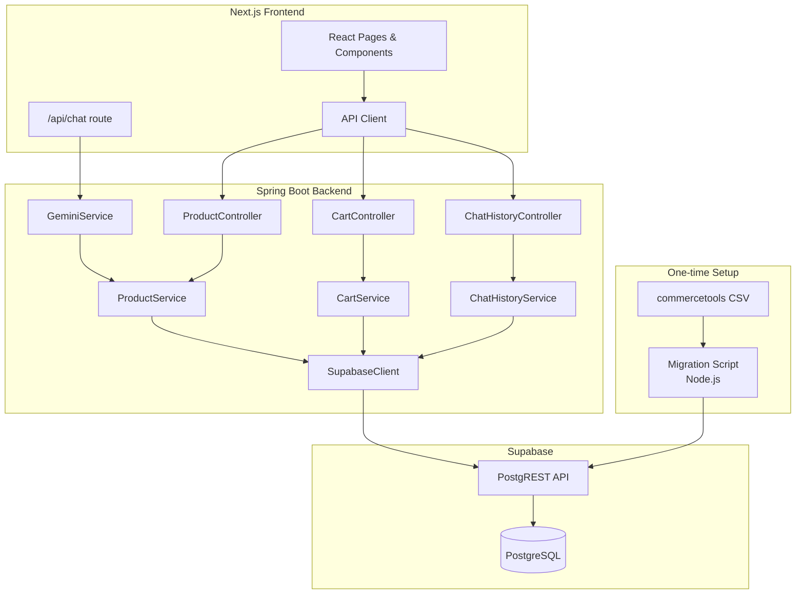

# Design Document: Supabase Integration

## Overview

This design replaces the AI Shopping Assistant's hardcoded product data and in-memory ConcurrentHashMap storage with Supabase (hosted PostgreSQL). The integration touches three layers:

1. **Database layer**: Supabase tables for products, cart, and chat history
2. **Backend layer**: Spring Boot services rewritten to use Supabase REST API via HTTP client
3. **Frontend layer**: Minimal changes — the Next.js app already fetches from the Spring Boot API; the hardcoded `products.ts` array is removed
4. **Data migration**: A Node.js script parses the commercetools CSV export and seeds ~100 mobile products into Supabase, plus sample promotions and bundles
5. **Promotions & bundles layer**: Database tables for promotions, product-promotion links, bundles, and bundle items, with backend endpoints and frontend display

The Spring Boot backend communicates with Supabase using its PostgREST API (HTTP/JSON), avoiding the need for a JDBC driver or JPA. This keeps the integration lightweight and consistent with Supabase's recommended access pattern.

## Architecture



### Key Design Decisions

1. **Supabase REST API over JDBC**: The Spring Boot backend uses Supabase's PostgREST HTTP API rather than a direct JDBC/JPA connection. This avoids adding heavy ORM dependencies, works naturally with Supabase's Row Level Security, and keeps the backend stateless.

2. **Shared SupabaseClient utility**: A single `SupabaseClient` class encapsulates HTTP calls to the Supabase REST API, handling authentication headers and JSON serialization. All three services (Product, Cart, ChatHistory) use this client.

3. **Node.js migration script**: The CSV import is a standalone Node.js script (not part of the Spring Boot app) since the frontend project already has a Node.js runtime and the CSV parsing ecosystem in Node is mature.

4. **Product ID migration**: Products in Supabase use UUID primary keys. The frontend and backend Product model's `id` field changes from `String` to `String` (UUID string representation), maintaining API compatibility.

## Components and Interfaces

### 1. SupabaseClient (New - Spring Boot)

A utility class that wraps HTTP calls to the Supabase PostgREST API.

```java
@Component
public class SupabaseClient {
    private final String supabaseUrl;
    private final String supabaseKey;
    private final HttpClient httpClient;
    private final Gson gson;

    // GET request with query parameters (e.g., ?select=*&category=eq.Mobile)
    public String get(String table, String queryParams);

    // POST request to insert rows
    public String post(String table, String jsonBody);

    // PATCH request to update rows
    public String patch(String table, String queryParams, String jsonBody);

    // DELETE request to remove rows
    public String delete(String table, String queryParams);
}
```

### 2. ProductService (Modified)

Replaces the in-memory `ArrayList` with Supabase queries.

```java
@Service
public class ProductService {
    private final SupabaseClient supabaseClient;

    public List<Product> getAllProducts();        // GET /rest/v1/products?select=*
    public Optional<Product> getProductById(String id);  // GET /rest/v1/products?id=eq.{id}
}
```

### 3. CartService (Modified)

Replaces the `ConcurrentHashMap` with Supabase table operations.

```java
@Service
public class CartService {
    private final SupabaseClient supabaseClient;

    public Cart getCart(String sessionId);
    public Cart addToCart(String sessionId, String productId, int quantity);
    public Cart removeFromCart(String sessionId, String productId);
    public Cart clearCart(String sessionId);
    public Cart updateQuantity(String sessionId, String productId, int quantity);
    public Cart addBatchToCart(String sessionId, List<String> productIds);
}
```

### 4. ChatHistoryService (Modified)

Replaces the `ConcurrentHashMap` with Supabase table operations.

```java
@Service
public class ChatHistoryService {
    private final SupabaseClient supabaseClient;

    public ChatHistory getHistory(String sessionId);
    public ChatHistory addMessage(String sessionId, String role, String text);
    public ChatHistory clearHistory(String sessionId);
}
```

### 5. PromotionService (New - Spring Boot)

Handles promotion and bundle queries from Supabase.

```java
@Service
public class PromotionService {
    private final SupabaseClient supabaseClient;

    public List<Promotion> getAllPromotions();                    // GET /rest/v1/promotions?select=*
    public List<Promotion> getPromotionsForProduct(String productId); // GET via product_promotions join
    public List<Bundle> getAllBundles();                          // GET /rest/v1/bundles?select=*,bundle_items(product_id)
    public List<Bundle> getActiveBundles();                      // GET /rest/v1/bundles?is_active=eq.true
}
```

```java
@RestController
@RequestMapping("/api/promotions")
public class PromotionController {
    // GET /api/promotions              → all promotions
    // GET /api/promotions/product/{id} → promotions for a specific product
}

@RestController
@RequestMapping("/api/bundles")
public class BundleController {
    // GET /api/bundles                 → all bundles (with items)
    // GET /api/bundles/active          → only active bundles
}
```

### 6. Promotion and Bundle Models (New)

```java
@Data @NoArgsConstructor @AllArgsConstructor
public class Promotion {
    private String id;
    private String name;
    private String description;
    private String discountType;      // "percentage" or "fixed_amount"
    private double discountValue;
    private String promoCode;         // nullable
    private String startDate;
    private String endDate;
    private String promotionalLabel;
    private boolean isActive;
    private String createdAt;
}

@Data @NoArgsConstructor @AllArgsConstructor
public class Bundle {
    private String id;
    private String name;
    private String description;
    private String discountType;
    private double discountValue;
    private boolean isActive;
    private String createdAt;
    private List<BundleItem> items;
}

@Data @NoArgsConstructor @AllArgsConstructor
public class BundleItem {
    private String id;
    private String bundleId;
    private String productId;
    private String createdAt;
}
```

### 7. Product Model (Modified)

Extended to include fields that exist in the frontend but were missing from the backend model.

```java
@Data
@NoArgsConstructor
@AllArgsConstructor
public class Product {
    private String id;          // UUID string
    private String name;
    private double price;
    private String description;
    private String category;
    private String image;       // maps to image_url in DB
    private Map<String, String> specs;
    private String brand;
    private int stock;
    private double rating;
    private List<String> tags;
}
```

### 8. Migration Script (New - Node.js)

```
scripts/seed-products.mjs
```

A standalone ES module script that:
1. Reads `Products_Export_16-02-26_20-40.csv`
2. Parses the commercetools `=""value""` encoding
3. Filters for mobile phone products by `productType.key` and `categories`
4. Deduplicates by product key (takes first variant)
5. Maps columns to the Product_Table schema
6. Extracts specs from structured attribute text
7. Inserts products into Supabase via the REST API
8. Seeds sample promotions (e.g., "Summer Sale 15% Off", "New Customer £20 Off", "Flash Deal 10% Off Samsung") into the Promotions_Table
9. Creates product-promotion associations in the Product_Promotions_Table, linking promotions to relevant imported products
10. Seeds sample bundles (e.g., "Budget Phone Bundle", "Flagship Duo Pack") into the Bundles_Table
11. Creates bundle-item associations in the Bundle_Items_Table, linking bundles to their constituent products

**Note:** The commercetools CSV does not contain discount, voucher, or offer data for phone products — those columns are all empty. All promotions and bundles data is self-generated sample data created by the migration script.

### 9. Frontend Changes

- **`src/lib/products.ts`**: Remove the hardcoded `products` array and `deals` array. Keep only the `Product` interface export.
- **`src/app/api/chat/route.ts`**: Fetch products from the backend API at request time instead of importing the static array. This ensures the AI assistant always has current product data.
- **`src/lib/prompts.ts`**: No changes needed — it already accepts products as a parameter.
- **Product cards and detail pages**: Display promotional labels (e.g., "15% Off"), calculated discounted prices alongside original prices, and available bundle deals. Fetch promotion data from `/api/promotions/product/{id}` and bundle data from `/api/bundles/active`.
- **TypeScript interfaces**: Add `Promotion` and `Bundle` interfaces to the frontend type definitions.

## Data Models

### Supabase SQL Schema

```sql
-- Products table
CREATE TABLE products (
    id UUID PRIMARY KEY DEFAULT gen_random_uuid(),
    name TEXT NOT NULL UNIQUE,
    price NUMERIC(10, 2) NOT NULL,
    description TEXT,
    category TEXT NOT NULL,
    image_url TEXT,
    specs JSONB DEFAULT '{}',
    brand TEXT,
    stock INTEGER DEFAULT 0,
    rating NUMERIC(3, 2) DEFAULT 0,
    tags TEXT[] DEFAULT '{}',
    created_at TIMESTAMPTZ DEFAULT now()
);

CREATE INDEX idx_products_category ON products(category);

-- Cart items table
CREATE TABLE cart_items (
    id UUID PRIMARY KEY DEFAULT gen_random_uuid(),
    session_id TEXT NOT NULL,
    product_id UUID NOT NULL REFERENCES products(id) ON DELETE CASCADE,
    quantity INTEGER NOT NULL DEFAULT 1,
    created_at TIMESTAMPTZ DEFAULT now()
);

CREATE INDEX idx_cart_items_session ON cart_items(session_id);
CREATE UNIQUE INDEX idx_cart_items_session_product ON cart_items(session_id, product_id);

-- Chat history table
CREATE TABLE chat_history (
    id UUID PRIMARY KEY DEFAULT gen_random_uuid(),
    session_id TEXT NOT NULL,
    role TEXT NOT NULL,
    message_text TEXT NOT NULL,
    created_at TIMESTAMPTZ DEFAULT now()
);

CREATE INDEX idx_chat_history_session ON chat_history(session_id);

-- Promotions table
CREATE TABLE promotions (
    id UUID PRIMARY KEY DEFAULT gen_random_uuid(),
    name TEXT NOT NULL,
    description TEXT,
    discount_type TEXT NOT NULL CHECK (discount_type IN ('percentage', 'fixed_amount')),
    discount_value NUMERIC(10, 2) NOT NULL,
    promo_code TEXT UNIQUE,
    start_date TIMESTAMPTZ,
    end_date TIMESTAMPTZ,
    promotional_label TEXT,
    is_active BOOLEAN DEFAULT true,
    created_at TIMESTAMPTZ DEFAULT now()
);

-- Product-Promotion junction table (many-to-many)
CREATE TABLE product_promotions (
    id UUID PRIMARY KEY DEFAULT gen_random_uuid(),
    product_id UUID NOT NULL REFERENCES products(id) ON DELETE CASCADE,
    promotion_id UUID NOT NULL REFERENCES promotions(id) ON DELETE CASCADE,
    created_at TIMESTAMPTZ DEFAULT now(),
    UNIQUE (product_id, promotion_id)
);

CREATE INDEX idx_product_promotions_product ON product_promotions(product_id);
CREATE INDEX idx_product_promotions_promotion ON product_promotions(promotion_id);

-- Bundles table
CREATE TABLE bundles (
    id UUID PRIMARY KEY DEFAULT gen_random_uuid(),
    name TEXT NOT NULL,
    description TEXT,
    discount_type TEXT NOT NULL CHECK (discount_type IN ('percentage', 'fixed_amount')),
    discount_value NUMERIC(10, 2) NOT NULL,
    is_active BOOLEAN DEFAULT true,
    created_at TIMESTAMPTZ DEFAULT now()
);

-- Bundle items junction table
CREATE TABLE bundle_items (
    id UUID PRIMARY KEY DEFAULT gen_random_uuid(),
    bundle_id UUID NOT NULL REFERENCES bundles(id) ON DELETE CASCADE,
    product_id UUID NOT NULL REFERENCES products(id) ON DELETE CASCADE,
    created_at TIMESTAMPTZ DEFAULT now()
);

CREATE INDEX idx_bundle_items_bundle ON bundle_items(bundle_id);
CREATE INDEX idx_bundle_items_product ON bundle_items(product_id);
```

### CSV Column Mapping (Commercetools → Product_Table)

| Commercetools CSV Column | Product_Table Column | Transformation |
|---|---|---|
| `name.en-GB` | `name` | Strip `=""` wrapper |
| Price centAmount (GBP) | `price` | Divide by 100 (pence → pounds) |
| `description.en-GB` | `description` | Strip `=""` wrapper |
| `categories` | `category` | Set to "Mobile" for all imported |
| Image URL column | `image_url` | Strip `=""` wrapper |
| Brand attribute | `brand` | Extract from structured attributes |
| Structured attributes text | `specs` | Parse key-value pairs for RAM, storage, screen, camera, processor, battery, OS, colour |
| Derived from attributes | `tags` | Generate from brand, OS, connectivity |
| N/A | `stock` | Default to random 10-100 |
| N/A | `rating` | Default to random 3.5-5.0 |

**Promotions & Bundles Data** (not from CSV — self-generated by migration script):

| Data | Target Table | Notes |
|---|---|---|
| Sample promotions | `promotions` | Script creates seasonal sales, brand discounts, promo code offers |
| Product-promotion links | `product_promotions` | Script assigns promotions to relevant products by brand/category |
| Sample bundles | `bundles` | Script creates bundle deals grouping complementary products |
| Bundle-product links | `bundle_items` | Script assigns 2-3 products per bundle |

### API Response Format (Unchanged)

The REST API contract between frontend and backend remains the same. The only change is that product `id` values are now UUIDs instead of short strings like `"ph-1"`.

</text>
</invoke>


## Correctness Properties

*A property is a characteristic or behavior that should hold true across all valid executions of a system — essentially, a formal statement about what the system should do. Properties serve as the bridge between human-readable specifications and machine-verifiable correctness guarantees.*

### Property 1: Product persistence round-trip

*For any* valid product object (with name, price, category, specs, brand, stock, rating, tags), inserting it into the Product_Table and then querying it back by ID should produce an equivalent product object with all fields matching.

**Validates: Requirements 1.1, 3.1, 3.2**

### Property 2: Cart persistence round-trip

*For any* session ID and sequence of add-to-cart operations with valid product IDs and quantities, retrieving the cart by session_id should return exactly the items that were added, with correct quantities, and should not include items from other sessions.

**Validates: Requirements 1.2, 3.3, 3.4**

### Property 3: Chat history persistence with ordering

*For any* session ID and sequence of chat messages added with timestamps, retrieving the chat history by session_id should return all messages in ascending created_at order, and should not include messages from other sessions.

**Validates: Requirements 1.3, 3.5, 3.6**

### Property 4: Commercetools CSV value parsing

*For any* string wrapped in the commercetools `=""value""` encoding, the parsing function should extract the inner value. Wrapping a value in `=""` and `""` and then parsing should return the original value (round-trip).

**Validates: Requirements 2.1**

### Property 5: CSV row to product mapping with spec extraction

*For any* valid commercetools CSV row containing name, price, description, brand, and structured attributes text, the mapping function should produce a product object where: name matches the source name.en-GB, price equals centAmount/100, and specs JSONB contains all extractable key-value pairs from the attributes text.

**Validates: Requirements 2.3, 2.4**

### Property 6: Mobile product filtering

*For any* list of commercetools CSV rows with mixed productType.key values, the filter function should return only rows where the productType.key or categories indicate a mobile phone product. The output list length should be less than or equal to the input list length, and every item in the output should satisfy the mobile filter criteria.

**Validates: Requirements 2.2**

### Property 7: Variant deduplication

*For any* list of CSV rows where some rows share the same product key, the deduplication function should return a list where each product key appears exactly once. The output length should be less than or equal to the input length.

**Validates: Requirements 2.5**

### Property 8: Migration output invariants

*For any* set of valid CSV rows processed by the migration pipeline, all output products should have: a valid UUID as id, category set to "Mobile", non-empty tags array, and the count of (imported + skipped) should equal the total input row count.

**Validates: Requirements 2.7, 2.8, 2.9**

### Property 9: Promotion and bundle persistence round-trip

*For any* valid promotion object (with name, discount_type constrained to 'percentage' or 'fixed_amount', discount_value, and optional promo_code, dates, label), inserting it into the Promotions_Table and querying it back by ID should produce an equivalent object. The same round-trip property applies to bundle objects inserted into the Bundles_Table.

**Validates: Requirements 7.1, 7.3**

### Property 10: Promotion-product and bundle-product relationship integrity

*For any* product and promotion linked via the Product_Promotions_Table, querying promotions for that product should include the linked promotion. Similarly, for any bundle and product linked via the Bundle_Items_Table, querying items for that bundle should include the linked product. Inserting a duplicate (product_id, promotion_id) pair should be rejected by the unique constraint.

**Validates: Requirements 7.2, 7.4**

### Property 11: Active bundle filtering

*For any* set of bundles with mixed is_active values, the getActiveBundles query should return only bundles where is_active is true. The count of active bundles returned should be less than or equal to the total bundle count, and every returned bundle should have is_active set to true.

**Validates: Requirements 7.6**

### Property 12: Discount price calculation

*For any* product price and promotion, the calculated discounted price should equal: price × (1 - discount_value/100) for percentage discounts, or price - discount_value for fixed_amount discounts. The discounted price should always be non-negative.

**Validates: Requirements 7.7**

## Error Handling

| Scenario | Component | Behavior |
|---|---|---|
| Supabase unreachable | SupabaseClient | Throws `SupabaseConnectionException`; services catch and return HTTP 503 |
| Product not found by ID | ProductService | Returns `Optional.empty()`; controller returns HTTP 404 |
| Cart for unknown session | CartService | Returns empty cart (same behavior as current) |
| Duplicate product name insert | Product_Table | PostgreSQL unique constraint violation; migration script logs and skips |
| Invalid cart product_id (FK violation) | Cart_Table | PostgreSQL FK constraint error; CartService returns HTTP 400 |
| CSV row missing name/price | Migration_Script | Skips row, increments skip counter, logs warning |
| Malformed CSV encoding | Migration_Script | Logs error for the row, continues processing remaining rows |
| Missing Supabase env vars | Spring Boot startup | Application fails to start with `IllegalStateException` listing missing variables |
| Promotion not found for product | PromotionService | Returns empty list; controller returns HTTP 200 with empty array |
| Bundle not found by ID | PromotionService | Returns `Optional.empty()`; controller returns HTTP 404 |
| Duplicate product-promotion link | Product_Promotions_Table | PostgreSQL unique constraint violation; returns HTTP 409 |
| Invalid discount_type value | Promotions_Table | PostgreSQL CHECK constraint violation; returns HTTP 400 |

## Testing Strategy

### Property-Based Testing

- **Library**: [jqwik](https://jqwik.net/) for Spring Boot (Java) property tests, [fast-check](https://github.com/dubzzz/fast-check) for Node.js migration script tests
- **Minimum iterations**: 100 per property test
- **Tag format**: `Feature: supabase-integration, Property {N}: {title}`

Property tests cover:
- Product/Cart/ChatHistory persistence round-trips (Properties 1-3) — using a test Supabase instance or in-memory PostgreSQL
- CSV parsing and transformation functions (Properties 4-8) — pure function tests, no database needed
- Promotion/bundle persistence round-trips and relationship integrity (Properties 9-10) — database tests
- Active bundle filtering correctness (Property 11) — database query test
- Discount price calculation (Property 12) — pure function test, no database needed

### Unit Testing

Unit tests complement property tests for specific examples and edge cases:
- Unique constraint violation on duplicate product names (Req 1.4)
- Foreign key cascade delete behavior (Req 1.5)
- Supabase connection failure returns HTTP 503 (Req 3.7, 3.8)
- Frontend error display on API failure (Req 4.3)
- AI assistant prompt includes product specs (Req 5.1, 5.3)
- Missing environment variable startup failure (Req 6.3)
- Discount_type CHECK constraint rejects invalid values (Req 7.1)
- Duplicate product-promotion pair rejected by unique constraint (Req 7.2)
- AI assistant prompt includes active promotions and bundles (Req 7.8)
- Migration script seeds non-empty promotions and bundles after product import (Req 7.5)

### Integration Testing

- End-to-end flow: seed products → fetch via API → verify response matches seeded data
- Cart operations: add → update → remove → clear → verify state at each step
- AI chat with database products: verify the system prompt contains current product data
